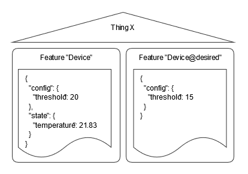
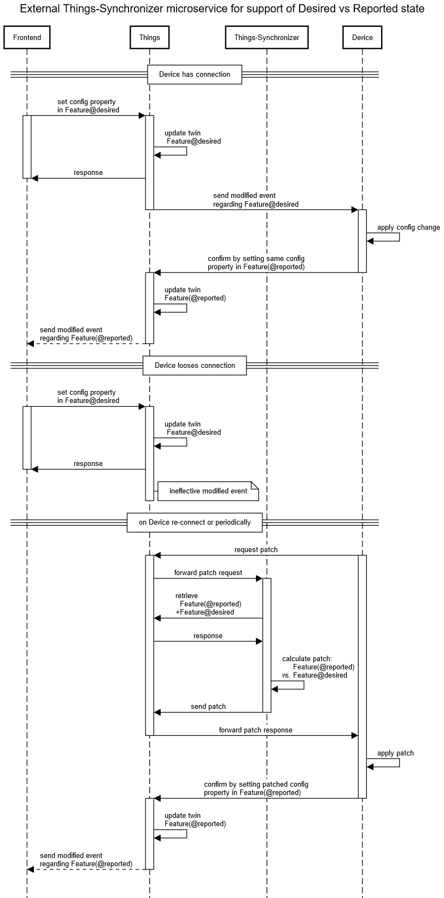

# Bosch IoT Things - Synchronizer example to support Desired vs Reported state of Devices

This example shows a simple implementation and usage scenario for an integration of IoT devices with Bosch IoT Things / Eclipse Ditto that is based on distinguishing between the current reported state of device information and a desired, target state for that device. This is mainly required for configuration parameters of devices that are connected either sporadically or unstably. Devices that are used for telemetry data ingestion only or devices that are connected very reliable without interruptions may not need such an approach.

This example shows a preliminary implementation that could be refactored towards a core functionally of Bosch IoT Things / Eclipse Ditto. See [ditto#125](https://github.com/eclipse/ditto/issues/125) for the discussion/progress on this functionally/refactoring.

# Prerequisites

The following background knowledge is required for this example

- npm
- TypeScript

# Chosen approach

Whenever an IoT application has to distinguish between the two perspectives "desired" and "reported" (current) state of an IoT device it should maintain these two perspectives within the same Thing that represents the device.

This can be done by using pairs of Features - one that represents the current state and a second that represents the desired state. By using a naming convention we accompany each Feature "abc" which holds the current state with a Feature "abc@desired" that holds the desired/target state. In general the @desired feature only contains configuration properties (e.g. thresholds) and no status properties (e.g. temperature).

This picture shows this approach:



IoT applications can use either one of these Features. To see the current, last reported state they access the Feature "abc". To set the desired state they write to Feature "abc@desired".

The IoT devices themselves should also be aware of these two perspectives.
There are two situations they should handle:
- if a device gets informed about modifications of the @desired Feature it should try to apply these changes (e.g. configure a threshold value). After this and in order to reflect the fact that it now knows the new configuration value it should confirm this by publishing a modification of the same configuration property to the "reported" state. When a IoT application looks at the Things it would then see both perspectives "in sync", i.e. the reported and the desired configuration property have the same value.
- as devices may miss notifications about modifications of the @desired Feature (i.e. when they are offline), the device should either regularly or at least when it recovers it's online connectivity trigger a synchronization. This synchronization is based on the request to receive a "patch" document that contains all differences between the reported state and the desired state. When the device receives the patch document it can apply the contained changes and confirm them by publishing the respective modifications to the reported state. On the next synchronization, it then would retrieve an empty patch document that indicates that everything is already "in sync".

The functionally to determine this patch is currently not included in Bosch IoT Things / Eclipse Ditto but is provided as a separate microservice within this example that is integrated into the Thing API. The invocation is triggered by sending a message with subject "determineDesiredPatch" and responds with a JSON patch document (see [IETF RFC 6902](https://tools.ietf.org/html/rfc6902)).

The following sequence diagram shows the interaction between device, Bosch IoT Things / Eclipse Ditto, the example synchronizer microservice and an IoT application frontend:



# Example implementation

The example implementation includes 3 components to illustrate the approach in one single runtime application based on Node.js:
- a Frontend that is a placeholder for an IoT application that set's up a Thing entity, periodically tries to set a desired configuration value and also periodically reads the whole state (reported and desired). The Frontend communicates with Bosch IoT Things / Eclipse Ditto using the HTTP API.
- a DeviceSimulation that acts as a replacement for a real device. This DeviceSimulation uses a WebSocket channel to integrate with Bosch IoT Things / Eclipse Ditto. This integration is not proposed for large scale scenarios with high number of device connections but should be replaced by an appropriate device connectivity channel. As soon as Eclipse Hono supports [command&control](https://www.eclipse.org/hono/api/command-and-control-api/) using MQTT the simulation could be switched to it.
- a Synchronizer that support calculating the different between reported and desired state. The calculation is triggered using a message-based interaction pattern ("determineDesiredPatch").

# Prepare

## Use an existing or request a new Bosch IoT Things service instance

Book the Bosch IoT Things cloud service: as described in our [documentation](https://things.eu-1.bosch-iot-suite.com/dokuwiki/doku.php?id=2_getting_started:booking:start).

## Prepare user (subject)

In real-world scenarios the 3 components would each run with it's own user context / technical user. For simplicity you can run them with one single user. For evaluation/example scenarios you can setup a evaluation user as described in [register a user](https://things.eu-1.bosch-iot-suite.com/dokuwiki/doku.php?id=examples_demo:createuser).

## Configure your settings

Set your credentials in the file "config.json". You can copy "config-template.json" as template and fill out placeholders.

# Build and Run

```
npm install
npm run build
npm run start
```

If you need to access the Internet using a Proxy configuration, please make sure to set the environment variable HTTPS_PROXY.

# Usage

# License
See the iot-things-examples top level README.md file for license details.
