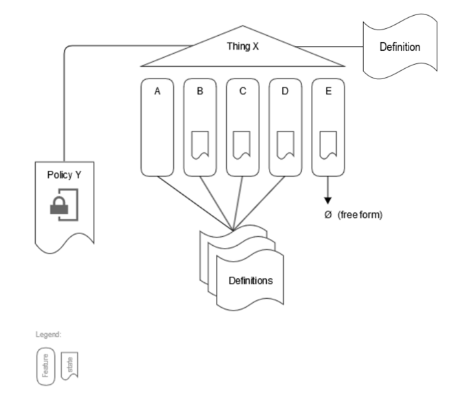

# Bosch IoT Things - End-to-End Digital Twin Example

**Table of contents**

- [Introduction](#introduction)
- [General concept](#general-concept)
  - [Structure of Digital Twins](#structure-of-digital-twins)
  - [Implementation and Deployment of Digital Twins](#implementation-and-deployment-of-digital-twins)
- [Example](#example)
  - [Example Digital Twin](#example-digital-twin)
  - [Example Microservice Implementation](#example-microservice-implementation)
- [Prepare](#prepare)
- [Build and Run](#build-and-run)
- [Extensions / Further-reading](#extensions--further-reading)
- [License](#license)

# Introduction

This example shows a simple end-to-end scenario for digital twins based on Bosch IoT Things / Eclipse Ditto with a digital twin that represents an IoT device.

## Prerequisites

The following background knowledge is required for this example:
- npm
- TypeScript

# General concept

## Structure of Digital Twins

A digital twin is an orchestration of many (all) aspects of an IoT device/product asset in order to get to a unified and simplified model and API to work with this IoT asset.
Each digital twin is represented as Thing and the aspects a represented as Features within this Thing.\
Some of these Features might represent a state with properties, while others represent an interface to some functionality (e.g. operations or events), and some Features are both.

Normally there are "contracts" that define the structure of the state and/or the interfaces of functionality. These contracts can be defined using Eclipse Vorto by describing Function Blocks. Some Features may also be "free form", i.e. there is no "written" contract that defines its state/functionality.

Finally, there needs to be a place where the orchestration is described. Policies are used to manage the orchestration. They include the roles and access rights and by this directly define the responsibility of these roles.

The following conceptual model describe the composition of a digital twin:

## Implementation and Deployment of Digital Twins

A digital twin can be implemented by using Bosch IoT Things / Eclipse Ditto for managing the orchestration and the state information of individual Features. In addition to this, the implementation of custom functionality is provided by custom microservices that are integrated into the overall digital twin.
The user of a digital twin (e.g. business application, frontend) can interact with the digital twins using the state and functionality provided via a single unified API.

All custom microservices that implement functionality of one/multiple Features can be integrated into the digital twin by using the Ditto protocol via multiple protocol bindings. You can use either a WebSocket binding, AMQP 1.0, or AMQP 0.91 (RabbitMQ) binding, depending on what is best suited regarding technology and non-functional requirements.

The most important characteristic of a digital twin is the representation of state and the functionality of the physical device that is connected to the Internet. This integration is done using the same approach and is explicitly prepared for integration with Bosch IoT Hub / Eclipse Hono.

The following diagram shows deployment options for digital twins with Bosch IoT Things / Eclipse Ditto:

# Example

## Example Digital Twin

This example illustrates the implementation of a digital twin with some typical aspects:
- **Device**: a feature that represents the state of a connected device. The device regularly measures the temperature and has a configured threshold value to adjust the minimum temperature that should be reported to the digital twin.\
The example contract is defined in: [http://vorto.eclipse.org/#/details/com.bosch.iot.suite.examples.digitaltwin:D100:1.0.0]
- **Accessories**: a custom functionality to determine supported accessory products that can be combined with the device (e.g. batteries, spare parts). In real-world scenarios this business functionality could be retrieved from a product catalog system (e.g. via SAP).
The example contract is defined in: [http://vorto.eclipse.org/#/details/com.bosch.iot.suite.examples.digitaltwin:Accessories:2.0.0]
- **Descriptive**: a small, reusable aspect with general-purpose descriptive information about a thing, defined as "static" state properties.
The contract is defined in: [http://vorto.eclipse.org/#/details/com.bosch.iot.suite.standard:Descriptive:1.0.0]
- **ProductInfo**: an unstructured set of properties describing more information about the overall product. There is no contract for this feature.

Adding all of these aspects in the general conceptual model gives the following picture:

# License
See the iot-things-examples top level README.md file for license details.
