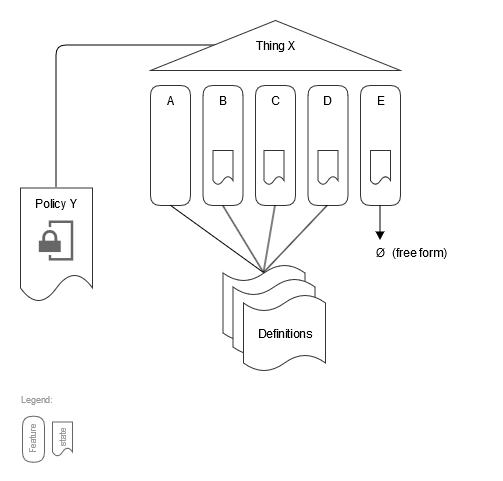
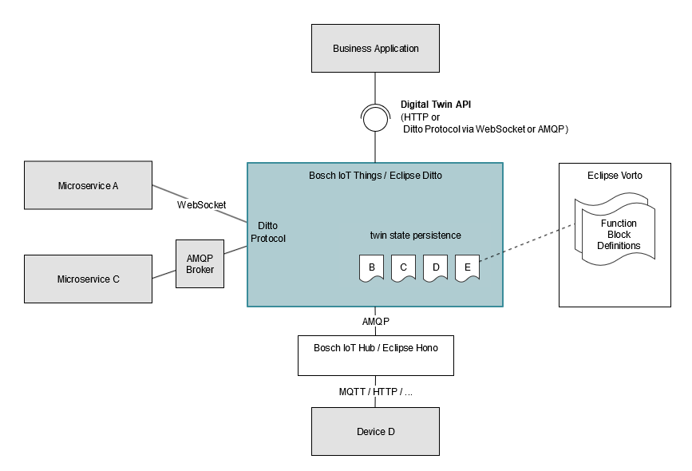
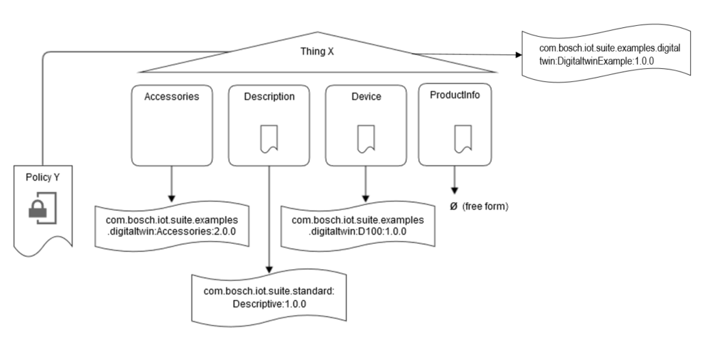
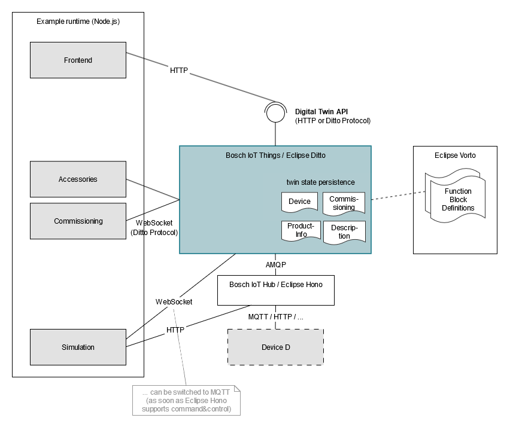

# Bosch IoT Things - End-to-End Digital Twin Example

**Table of contents**

- [Introduction](#introduction)
- [General concept](#general-concept)
  - [Structure of Digital Twins](#structure-of-digital-twins)
  - [Implementation and Deployment of Digital Twins](#implementation-and-deployment-of-digital-twins)
- [Example](#example)
  - [Example Digital Twin](#example-digital-twin)
  - [Example Microservice Implementation](#example-microservice-implementation)
- [Prepare](#prepare)
- [Build and Run](#build-and-run)
- [Extensions / Further-reading](#extensions--further-reading)
- [License](#license)

# Introduction

This example shows a simple end-to-end scenario for digital twins based on Bosch IoT Things / Eclipse Ditto with a digital twin that represents an IoT device.

# General concept

## Structure of Digital Twins

A digital twin is an orchestration of many (all) aspects of an IoT device/product asset in order to get to a unified and simplified model and API to work with this IoT asset.
Each digital twin is represented as Thing and the aspects a represented as Features within this Thing.\
Some of these Features might represent a state with properties, while others represent an interface to some functionality (e.g. operations or events), and some Features are both.

Normally there are "contracts" that define the structure of the state and/or the interfaces of functionality. These contracts can be defined using Eclipse Vorto by describing Function Blocks. Some Features may also be "free form", i.e. there is no "written" contract that defines its state/functionality.

Finally, there needs to be a place where the orchestration is described. Policies are used to manage the orchestration. They include the roles and access rights and by this directly define the responsibility of these roles.

The following conceptual model describe the composition of a digital twin:



## Implementation and Deployment of Digital Twins

A digital twin can be implemented by using Bosch IoT Things / Eclipse Ditto for managing the orchestration and the state information of individual Features. In addition to this, the implementation of custom functionality is provided by custom microservices that are integrated into the overall digital twin.
The user of a digital twin (e.g. business application, frontend) can interact with the digital twins using the state and functionality provided via a single unified API.

All custom microservices that implement functionality of one/multiple Features can be integrated into the digital twin by using the Ditto protocol via multiple protocol bindings. You can use either a WebSocket binding, AMQP 1.0, or AMQP 0.91 (RabbitMQ) binding, depending on what is best suited regarding technology and non-functional requirements.

The most important characteristic of a digital twin is the representation of state and the functionality of the physical device that is connected to the Internet. This integration is done using the same approach and is explicitly prepared for integration with Bosch IoT Hub / Eclipse Hono.

The following diagram shows deployment options for digital twins with Bosch IoT Things / Eclipse Ditto:



# Example

## Example Digital Twin

This example illustrates the implementation of a digital twin with some typical aspects:
- **Device**: a feature that represents the state of a connected device. The device regularly measures the temperature and has a configured threshold value to adjust the minimum temperature that should be reported to the digital twin.\
The example contract is defined in: [http://vorto.eclipse.org/#/details/com.acme.device:D100:2.1.0]
- **Commissioning**: a feature (separate to _Device_) that abstracts the "workflow" to execute all preparation steps for a new device, so that it can be connected afterwards. The workflow interface is included in the digital twin in order to be part of the overall orchestration including access control and to support reflecting status of the commissioning process within the digital twin. In the example, the commissioning implements the registration of the device in Bosch IoT Hub / Eclipse Hono.\
The contract is defined in: [http://vorto.eclipse.org/#/details/org.eclipse.ditto:HonoCommissioning:1.0.0]
- **Accessories**: a custom functionality to determine supported accessory products that can be combined with the device (e.g. batteries, spare parts). In real-world scenarios this business functionality could be retrieved from a product catalog system (e.g. via SAP).
The example contract is defined in: [http://vorto.eclipse.org/#/details/com.acme.catalog:Accessories:2.0.0]
- **Descriptive**: a small, reusable aspect with general-purpose descriptive information about a thing, defined as "static" state properties.
The contract is defined in: [http://vorto.eclipse.org/#/details/org.eclipse.vorto.standard:Descriptive:1.0.0]
- **ProductInfo**: an unstructured set of properties describing more information about the overall product. There is no contract for this feature.

Adding all of these aspects in the general conceptual model gives the following picture:



## Example microservice implementation

The example implementation includes all the microservices that provide the features of the digital twin as well as an exemplary business application ("Frontend") in one single runtime application based on Node.js.
In addition, it adds a simple device simulation microservice that simulates a real physical device by sending telemetry data and respecting configuration data.

INFO: The device simulation currently uses the Bosch IoT Hub / Eclipse Hono HTTP channel to emit telemetry data AND in parallel the Bosch IoT Things / Eclipse Ditto WebSocket channel to receive configuration changes. The WebSocket channel is not proposed for large scale scenarios with high number of device connections but should be replaced by an appropriate device connectivity channel. As soon as both Bosch IoT Hub / Eclipse Hono and Bosch IoT Things / Eclipse Ditto support an integrated [command&control](see https://www.eclipse.org/hono/api/command-and-control-api/) pattern using MQTT, the simulation could be switched to it for both channels.

Following the deployment model from above this looks like this:



The policy-based orchestration works with different (technical) users that are used for each microservice. In the policy notation the IDs of these users are called subjects and the subjects reflect the role each microservice has within the digital twin:
You will need users for following roles:
- **owner**: this is a user that owns the overall digital twin. It is set-up to have all access rights on all features and the policy itself. In the example the _Frontend_ user is the owner of the digital twin.
- **integration**: this is a "virtual" user/subject that is used to define access rights used in the integration with Bosch IoT Hub / Eclipse Hono. This subject is allowed to write status properties and read configuration properties. As it is "virtual", no real (technical) user entity is required, but any unique, arbitrary subject ID can be used for that.
- **simulation**: used by the device simulation microservice to act as replacement for a real physical device. It will be configured with the same access rights as the _Integration_ subject.
- **accessories**: as the example accessories microservice uses a message-based interaction pattern ("retrieveSupportedAccessories") this subject requires receive permissions on these messages. The retrieval is based on product information and so this subject requires access on the respective _ProductInfo_ feature also.
- **commissioning**: the commissioning workflow is also integrated using message-based interaction patterns (e.g. "commissionDevice"). Access rights to receive these messages are defined and also access rights to manage the state of the _Commissioning_ feature in order to write result information.

The following JSON snippet shows a Bosch IoT Things / Eclipse Ditto policy document, that defined all the access rights of the various roles for one or more digital twin instances. As described this also defines the orchestration of these roles within the digital twin:

```json
{
  "policyId": "com.example.foo.bar:policy-100",
  "entries": {
    "owner": {
      "subjects": {
        "iot-permissions:0e08a311-xxxx-xxxx-xxxx-6209bbf7ad7a": { "type": "iot-permissions-userid" }
      },
      "resources": {
        "policy:/": {
          "grant": [ "READ", "WRITE" ],
          "revoke": []
        },
        "thing:/": {
          "grant": [ "READ", "WRITE" ],
          "revoke": []
        },
        "message:/": {
          "grant": [ "READ", "WRITE" ],
          "revoke": []
        }
      }
    },
    "device": {
      "subjects": {
        "integration:b55b6221-xxxx-xxxx-xxxx-d7cd9cbf454a:hub-abc": { "type": "iot-things-integration" },
        "iot-permissions:cae7eaa0-xxxx-xxxx-xxxx-f2da514201bb": {
           "type": "iot-permissions-userid",
           "//": "user for device simulation"
        }
      },
      "resources": {
        "thing:/features/Device/properties/status": {
          "grant": [ "WRITE" ],
          "revoke": []
        },
        "thing:/features/Device/properties/config": {
          "grant": [ "READ" ],
          "revoke": []
        }
      }
    },
    "accessories": {
      "subjects": {
        "iot-permissions1799eeb9-xxxx-xxxx-xxxx-0f2308640b9d": { "type": "iot-permissions-userid" }
      },
      "resources": {
        "thing:/features/Productinfo": {
          "grant": [ "READ" ],
          "revoke": []
        },
        "message:/features/Accessories/inbox/messages": {
          "grant": [ "READ", "WRITE" ],
          "revoke": []
        }
      }
    },
    "commissioning": {
      "subjects": {
        "iot-permissions:96603fc5-xxxx-xxxx-xxxx-3ca286a30bbe": { "type": "iot-permissions-userid" }
      },
      "resources": {
        "thing:/features/Commissioning": {
          "grant": [ "READ", "WRITE" ],
          "revoke": []
        },
        "message:/features/Commissioning/inbox/messages": {
          "grant": [ "READ" ],
          "revoke": []
        }
      }
    }
  }
}
```

# Prepare

## Use an existing or request a new Bosch IoT Things service instance

Book the Bosch IoT Things cloud service: as described in our [documentation](https://things.eu-1.bosch-iot-suite.com/dokuwiki/doku.php?id=2_getting_started:booking:start).

## Only required for device integration/simulation: Use an existing or request a new Bosch IoT Hub tenant

Request your own tenant for the Bosch IoT Hub (based on Eclipse Hono): see [Bosch IoT cloud service](https://www.bosch-iot-suite.com/service/hub/) for details.

After you have both instances (Things and Hub) in place, you can setup the integration between the two.
See the [Bosch IoT Thing documentation](https://things.eu-1.bosch-iot-suite.com/dokuwiki/doku.php?id=2_getting_started:booking:manage-y-connection) for details.

## Prepare users (subjects) for each microservice

As described above, the microservices of a digital twin use different (technical) users/subjects. To prepare and manage these subjects you can use [Bosch IoT Permissions](https://www.bosch-iot-suite.com/permissions/).
For evaluation/example scenarios you can alternatively setup some evaluation users as described at: [Register a user](https://things.eu-1.bosch-iot-suite.com/dokuwiki/doku.php?id=examples_demo:createuser).

## Configure your settings

Set your credentials in a file called "config.json". You can copy "config.json-template" as template and fill out the placeholders.

# Build and Run

```
npm install
npm run build
npm run start
```

If you need to access the Internet using a proxy configuration, please make sure to set the environment variable HTTPS_PROXY.

# Extensions / Further reading

A lot of usage scenarios of digital twins require the integration of **history data** of properties of one or more Features of a digital twin. Therefore we provide an example implementation of a general-purpose historian service that can be easily plugged into any digital twin to provide a managed way for collecting and accessing history data. See this example for details: [https://github.com/bsinno/iot-things-examples/tree/dev/historian-influxdb]

# License
See the iot-things-examples top level README.md file for license details.
