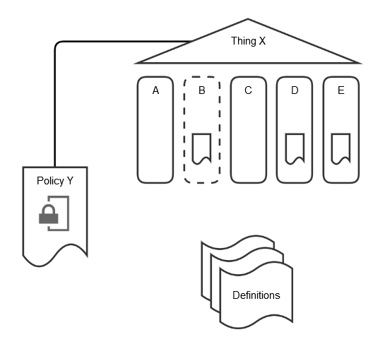
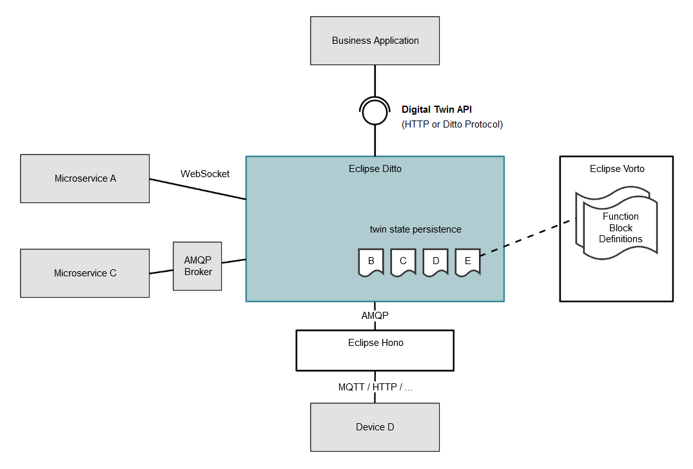

# Bosch IoT Things - End-to-End Digital Twin Example

This example shows a simple End-to-End scenario for Digital Twins based on Bosch Io Things.

# Description

The example uses the following conceptual model to describe a Digital Twin:



The deployment of this Digital Twin example is like this:



# Prepare

## Use an existing or request a new Bosch IoT Things service instance

<a href="https://things.apps.bosch-iot-cloud.com/dokuwiki/doku.php?id=002_getting_started:booking:booking">Book the Bosch IoT Things cloud service</a>

## Use an existing or request a new Bosch IoT Hub tenant

Use the Sandbox of Bosch IoT Hub or request your own evaluation tenant. See [http://docs.bosch-iot-hub.com/] for details.

## Configure your settings

Set your credentials in the file "config.json". You can copy "config.json-template" as template and fill out placeholders.

# Build and Run

```
npm install
npm run build
npm run start
```

If you need to access the Internet using a Proxy configuration, please make sure to set the environment variable HTTPS_PROXY.

# License
See the iot-things-examples top level README.md file for license details.
