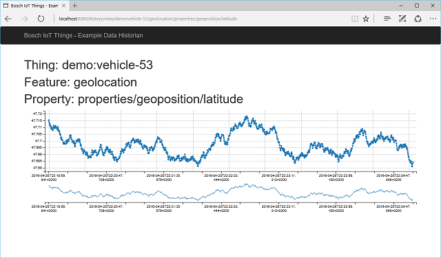
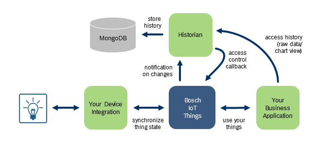

## Bosch IoT Things - Example Data Historian

This example shows how to collect and use data history of property values.
It shows how to collect and store the data in a MongoDB, how to make them accessible via REST and how to present them in a timeseries chart.



# How it works?

## Overview

The following diagram shows how the Example Data Historian could work:



Step by step:

- Your (existing) IoT solution uses Bosch IoT Things to integrate it's devices
- This Historian appication can run seperatly to your applications
- For things that it is allowed to it subscribes to all changes on the different Features of the managed Things
- All fetched changes are stored as a time series record in a MongoDB database
- The Historian application can be used by your business solution to access or to display history data of individual Thing properties

## MongoDB document layout

The time serias data is recorded in a simple document structure in MongoDB.

For each and every single (scalar) property of a Thing excactly one document is managed.
This document has a unique id consisting of "<thing-id>/<feature-id>/properties/<property-path>".
The documents have to array fields: a "values" array and a "timestamps" array.
Both arrays are updated on every property change. 
The new value and timestamp is added to the end of the array
In addition the array is sliced to not exceed a fixed element count. 

| Document Id | Content |
| --- | --- |
| demo:vehicle-53/features/envscanner/properties/velocity | { "_id": ..., "values": [ 60.50, 62.94, 64.12, ... ], "timestamps: [ "2016-04-28T22:19:59.841Z", "2016-04-28T22:20:03.143Z", "2016-04-28T22:20:06.047Z", ... ] } |
| demo:vehicle-53/features/envscanner/properties/acceleration | { "_id": ..., "values": [ 2.21, 1.95, 1.59, ... ], "timestamps: [ "2016-04-28T22:19:59.841Z", "2016-04-28T22:20:03.143Z", "2016-04-28T22:20:06.047Z", ... ] } |

# How to run it?

## Create a Solution with a private/public key

<a href="https://things.apps.bosch-iot-cloud.com/dokuwiki/doku.php?id=002_getting_started:cr_02_booking-cr-service.txt">Book the Bosch IoT Things cloud service</a>

Add the CRClient.jks to the folder "src/main/resources".

## Configure your Client Id and other settings

Create file "config.properties" in folder "src/main/resources". _Please change the ids._

```
thingsServiceEndpointUrl=https://things.apps.bosch-iot-cloud.com
thingsServiceMessagingUrl=wss\://events.apps.bosch-iot-cloud.com
clientId=###your solution id ###:historian
apiToken=###your solution api token ###
keyAlias=CR
keyStorePassword=#### your key password ###
keyAliasPassword=#### your key alias password ###
http.proxyHost=#### your http proxy host, if you need one ###
http.proxyPort=#### your http proxy host, if you need one ###
```

## Install and start a local MongoDB

See https://www.mongodb.org/

## Build

```
mvn clean install
```

## Run it

Use the following command to run the example.

```
mvn exec:java
```

## Add ACL for "historian" to your things

Add an ACL for the "historian"-client to any thing you already have. See the inventory-browser and vehicle-simulator examples.

```
{
   ...
   "acl": {
      ...
      "###your solution id ###:historian": {
         "READ": true,
         "WRITE": false,
         "ADMINISTRATE": false
      }
   }
   ...
}
```

## Usage

Use the following URL to look at the collected data:

http://localhost:8080/history/data/###thingId###/features/###featureId###/properties/###propertyPath###

You can specifiy multiple things/features/properties to get data for mulitple values in one result.
To do this you can use comma seperated values within square brackets to define multiple parameters.

e.g.

- http://localhost:8080/history/data/demo:vehicle-53/features/geolocation/properties/geoposition/latitude
- http://localhost:8080/history/data/demo:vehicle-53/features/geolocation/properties/geoposition/[latitude,longitude]
- http://localhost:8080/history/data/demo:vehicle-53/features/[geolocation/properties/geoposition/latitude,enginetemperature/properties/value]
- http://localhost:8080/history/data/[demo:vehicle-53/features/geolocation/properties/geoposition/latitude,demo:vehicle-99/features/geolocation/properties/geoposition/latitude]

Use the following URL to view at the collected data as a timeseries chart, following the same format above to take into account multiple feature/values.

http://localhost:8080/history/view/###thingId###/features/###featureId###/properties/###propertyPath###

e.g.
- http://localhost:8080/history/view/demo:vehicle-53/features/geolocation/properties/geoposition/latitude
- http://localhost:8080/history/view/demo:vehicle-53/features/[geolocation/properties/geoposition/latitude,enginetemperature/properties/value]

## License

See the cr-examples top level README.md file for license details.
