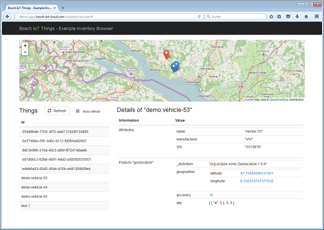

# Bosch IoT Things - Example Inventory Browser

This example shows how to create a simple user interface to list things and their details and show the things on a map.



# Use an existing or request a new Bosch IoT Things service instance

Book the Bosch IoT Things cloud service: as described in our [documentation](https://things.s-apps.de1.bosch-iot-cloud.com/dokuwiki/doku.php?id=2_getting_started:booking:start).

# Configure your API Token and other settings

Create or adjust file "src/main/resources/config.properties"

```
thingsServiceEndpointUrl=https://things.s-apps.de1.bosch-iot-cloud.com
apiToken=### your Bosch IoT Things Solution API Token ###
http.proxyHost=### your http proxy host, if you need one ###
http.proxyPort=### your http proxy port, if you need one ###
```

# Build

Use the following maven command to build the server:
```
mvn clean install
```

# Run Server

Use the following command to run the server.
```
java -jar target/inventory-browser.jar
```

# Usage

## Show Dashboard

Browse to the Bosch IoT Things Dashboard: <https://things.s-apps.de1.bosch-iot-cloud.com/>

## Create Demo User

Use the dashboard to create a demo user.

## Show Inventory Browser

Browse to the example web app: <http://localhost:8080/inventory-browser/>

## Create Empty Thing

In REST Documentation (Swagger): <https://apidocs.bosch-iot-suite.com/?urls.primaryName=Bosch%20IoT%20Things%20-%20API%20v1>
use "Things - POST /things"

thing:
```
{}
```

Look in the response for the created Thing. Within this you will find your user's unique id which can be used in the next steps.

## Create Thing for Herbie

Use "Things - PUT /things"
thingId: demo:vehicle-53

thing:

_Change the ids before executing this call._
```
{
   "acl":{
      "### id of your user ###":{
         "READ":true,
         "WRITE":true,
         "ADMINISTRATE":true
      },
      "### id of your solution ###:gateway":{
         "READ":true,
         "WRITE":true,
         "ADMINISTRATE":false
      }
   },
   "attributes":{
      "name":"Herbie 53",
      "manufacturer":"VW",
      "VIN":"5313879"
   },
   "features":{
      "geolocation":{
         "definition": [ "org.eclipse.vorto.Geolocation:1.0.0" ],
         "properties":{
            "geoposition":{
               "latitude":47.68,
               "longitude":9.3865
            },
            "accuracy":15
         }
      },
      "orientation":{
         "properties":{
            "x":30,
            "y":20,
            "z":147
         }
      }
   }
}
```

# Refresh Things in Inventory Browser

# Update Position of Herbie

Use "Features - PUT /things/{thingId}/features/{featureId}/properties/{propertyPath}"

thingId: demo:vehicle-53

featureId: geolocation

propertyPath: features/geolocation/properties/geoposition/latitude
```
47.665
```

propertyPath: features/geolocation/properties/geoposition
```
{
  "latitude": 47.68,
  "longitude": 9.3865
}
```

# Refresh Things in Inventory Browser

# More example Things

See [testdata.json](testdata.json) for more example things to create.

# License

See the iot-things-examples top level README.md file for license details.
