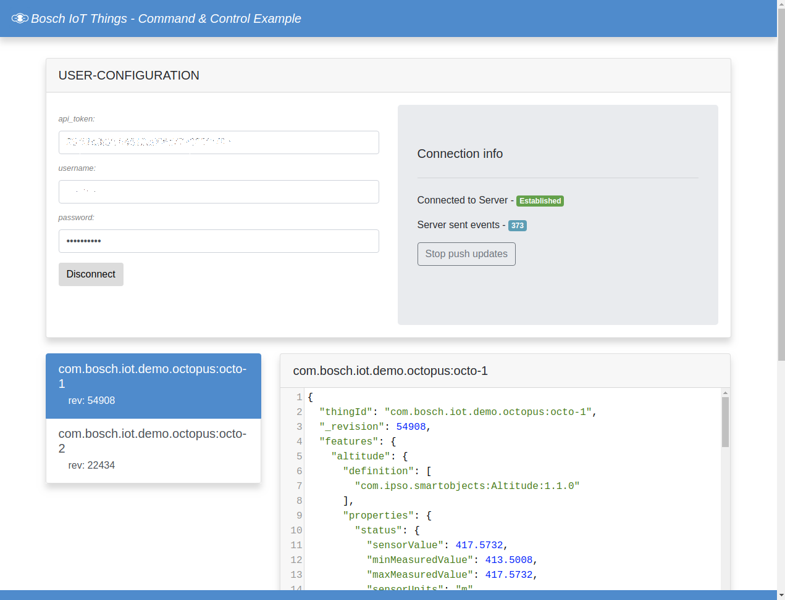

# Bosch IoT Things - Octopus app

This example provides a web application to manage your things.
It shows how to use Bosch IoT Things API to communicate with the "digital twin" of the device and the physical device itself.

Before you can start, you have to prepare your setup. This includes the following steps:
1. [Add a subject to your policy](#add-a-subject-to-your-policy)
2. [Send messages to your device and switch LEDs via the web application](#getting-started)



## Add a subject to your policy

A policy enables developers to configure **fine-grained** access control for Things and other entities in an easy way.
A specific policy provides someone (called **subject**), permission to _read_ and/or _write_ at a given **resource**.
Your Device Provisioning Request at our API generated a default policy for you.

In order to get _read_ access to our registered thing on the things-dashboard, we have to create a new subject with our `bosch-id` by requesting the `PUT` `​/policies​/{policyId}​/entries​/{label}` route on our [Bosch IoT Things HTTP API](https://apidocs.bosch-iot-suite.com/?urls.primaryName=Bosch%20IoT%20Things%20-%20API%20v2#/).
                                                                                                                                                                                                                   
You will need to do the following steps:

1. Authorize your API request via Suite authorization token, by clicking on the **Authorize** button on the upper right corner and paste the token into the dedicated input field.
2. Provide your _policyId_ on the required input-field. You can find your _policyId_ in the response of your previous Device Provisioning request.
3. Set any _label_ (e.g `solution-owner`) for your new **subject**, by typing it in the dedicated input-field.
4. Edit the request body to send a valid message to the server.

Your request body should contain the following information:

```json
{
  "subjects": {
    "bosch:<your-technical-user-id>": {
      "type": "bosch-id"
    }
  },
  "resources": {
    "thing:/": {
      "grant": [
        "READ" 
      ],
      "revoke": []
    }
  }
}
```
You will need to edit the following `<placeholders>`:
* "bosch:`<your-technical-user-id>`" - You can find your _technical-user-id_  under the Show Credentials button of your Service Subscription page in the Bosch IoT Suite

Click Execute to submit the request.

Upon success, you have created a subject in your policy with _read_ access for your registered thing (octopus board).

## Front-end

The example uses the following dependencies:

- [Vue.js](https://vuejs.org)
- [Bootstrap](http://getbootstrap.com/)
- [Axios](https://github.com/axios/axios)
- [Vuex](https://vuex.vuejs.org/)
- [Codemirror](https://codemirror.net/)

### Getting started

Installation:

```bash
$ npm install
```

Running Dev-Server (with hot reloading):

```bash
$ npm run serve
```

You can now open your browser and navigate to the app at `http://localhost:3000`

## Use the app to remotely change the LED setting

After you have added a JWT token and pressed _connect_, you should see a list with your things (at least the octopus).

Just click on the thing you want to observe or send data to.

Depending on your device, you can now send command messages to it.

This example provides LED control on the Octopus board via messages.

Send following message to the topic `switch_led`.

```json
{
  "r": 0,
  "g": 0,
  "b": 0,
  "w": 0
}
```

This is in fact a POST request at the [Messages API](https://apidocs.bosch-iot-suite.com/?urls.primaryName=Bosch%20IoT%20Things%20-%20API%20v2#/Messages).

The response will be either _success_ or an _error_ message.

In case the request was successful, the LED is switched off. The board will send the respective telemetry data to the Hub, which forwards the data to Bosch IoT Things.

The web application uses SSE ('server sent events') to get live updates from Bosch IoT Things - these updates are directly reflected in the web application.

From this point on feel free to extend the code and build your own IoT solution.

Happy coding!
