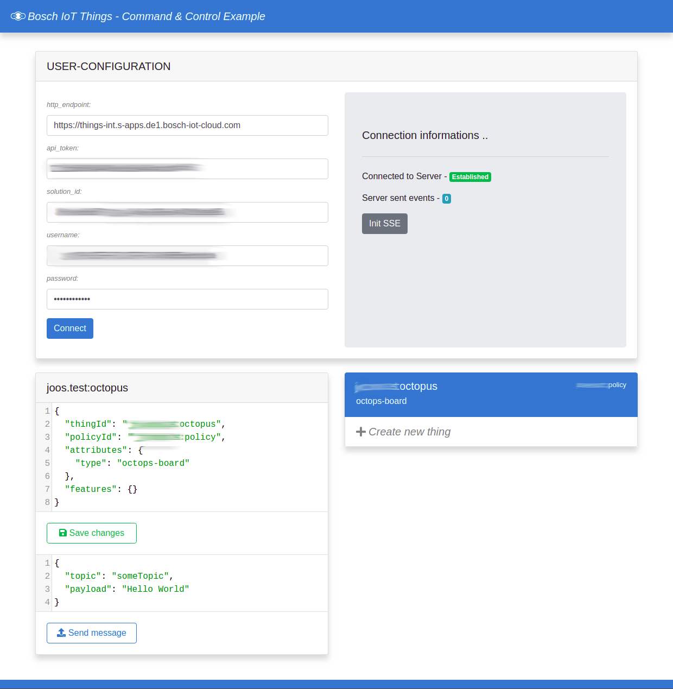

# Octopus-Bidirectional



## Summary

This example shows how to use the services Bosch IoT Things and Bosch IoT Hub to connect your device with your frontend solution. It shows how to subscribe to these Bosch services, how to use the HTTP endpoints and how to send data within these services.
Furthermore will be shown how to prototype a real world device based on the Octopus board (ESP8266) and a webapplication to manage your things.
The device will be able to connect automatically to a given wireless internet access, to send telemtry data to the things service and react to messages which will be sent by the webapplication.
The webapplication will use Bosch IoT Things HTTP endpoints to communicate with the service itself and the device. We will use the telemetry, event as well as the command & control feature.


## Setting up Bosch IoT Things and Hub

All Bosch IoT Suite services can be booked online at [Bosch IoT Suite Portal](https://accounts.bosch-iot-suite.com/subscriptions). For all subscriptions, you will need a Bosch ID for authentication. If you don't have a Bosch ID yet, feel free to register a new account. Once you are successfully registered, you will be redirected to the Bosch IoT Suite Portal.

For a more detailed guidance, see [Octopus-Hub-Things-example](https://github.com/bsinno/iot-things-examples/tree/master/octopus-hub-things-example).

Once you are set and there is a description for Bosch Iot Things and Bosch IoT hub, we can open a new connection on the Things Dashboard. You will find a Link to the Things Dashboard under point 'actions' in your [service subscriptions table](https://accounts.bosch-iot-suite.com/subscriptions/).

Under menu item Connections, we will create our first connection. There are serveral possibilities - depending on your need, you can create the connection type that fits them. For this usecase, we choose Bosch IoT Hub connection. The wizard will guide you through the creation process. The questioned credentials can be found under point 'actions' in your [service subscriptions table](https://accounts.bosch-iot-suite.com/subscriptions/). The connection creation wizard will ask for a authorization context and in this example we will use 'integration:<YOUR-SOLUTION-ID>:octopus'. In the next step we will use a little java program, which will create a thing and a policy with this authorization context.

This example provides a small Java program, which adds a thing and a policy to Bosch IoT Things. Furthermore, the program adds this thing with valid credentials to the Bosch IoT Hub.

#### Configure the Java program

Before we can start using this program, we have to configure the `java/src/main/resource/application.properties` file.

If you have filled out the empty fields with valid credentials we can start the program with: `mvn clean compile exec:java` in the java folder.

## Connecting an Arduino Device to Bosch IoT Things and Hub

### Requirements

1. An Arduino or another developer board like "Funduino" etc. This example will work with an
   Octopus-board (which is pretty rare but most of the code will work with every other board with an ESP8266 on it).
2. [Arduino IDE](https://www.arduino.cc/en/Main/Software)

### Preparing

1. Add the ESP8266 Platform to the IDE, see [ESP8266 Arduino Platfrom](https://github.com/esp8266/Arduino).
2. Install the following libraries (Sketch -> Include Library -> Manage Libraries)
   1. [Adafruit Unified Sensor Library](https://github.com/adafruit/Adafruit_Sensor)
   2. [Adafruit BME680 library](https://github.com/adafruit/Adafruit_BME680)
   3. [Adafruit BME280 library](https://github.com/adafruit/Adafruit_BME280)
   4. [Adafruit BNO055 library](https://github.com/adafruit/Adafruit_BNO055)
   5. [Adafruit NeoPixel library](https://github.com/adafruit/Adafruit_NeoPixel)
   6. [PubSubClient library](https://github.com/knolleary/pubsubclient)
   7. [ArduinoJson](https://github.com/bblanchon/ArduinoJson)
   8. [ESP8266Ping](https://github.com/dancol90/ESP8266Ping)
3. Edit the file `${ArduinoDirectory}/libraries/pubsubclient/src/PubSubClient.h` and set the
   `MQTT_MAX_PACKET_SIZE` to `2048`.

### Getting started

The Arduino Sketch, we have prepared, publishes the sensor information via the Bosch IoT Hub to Bosch IoT Things.

Open `iot-device/octopus-hub/octopus-hub.ino` in your Arduino IDE.

All properties have to be set in `iot-device/octopus-hub/settings.h` Just create this file from the following template and replace XXX placeholders with your configuration properties.

```cpp
#ifndef SETTINGS_H
#define SETTING_H

// ---- WiFi configuration ----
#define WIFI_SSID "XXX" // The SSID of the WiFi you want your octopus board to connect to
#define WIFI_PASSWORD "XXX" // The password of the WiFi you want your octopus board to connect to

// ---- Things registration properties ----
#define THINGS_NAMESPACE "XXX" // The namespace you created in your solution
#define THING_NAME "octopus" // should not be changed unless you changed code in the java preparation program. This is the thing id without the namespace.

// ---- Hub registration properties ----
#define HUB_TENANT "XXX" // The tenant id of your hub instance
#define HUB_DEVICE_ID "XXX" // The device id that was printed out by the java preparation program
#define HUB_DEVICE_AUTH_ID "XXX" // The auth id that was printed out by the java preparation program
#define HUB_DEVICE_PASSWORD "XXX" // The device password that was printed out by the java preparation program

// ---- Update rate of sensors ----
#define SENSOR_UPDATE_RATE_MS 5000 // Print updated sensor value every 5 seconds
#define LOOP_DELAY 100

// ---- Hub MQTT configuration ----
// Do not change this
#define MQTT_BROKER "mqtt.bosch-iot-hub.com"
#define MQTT_PORT 8883

//#define BME280 // uncomment this line if your board has a BME280 instead of BME680

extern const unsigned char mqtt_server_ca[];
extern const unsigned int mqtt_server_ca_len;

#endif
```

Once you have done that, you can flash the Sketch to your developer board. The device will connect automatically to Bosch IoT Hub which manages the connection for Bosch IoT Things.

The provided Arduino sketch is capable of connecting to the Bosch IoT Hub with TLS standard, sending and receiving MQTT messages, read it's sensors and to set it's built in LED's depending on incoming messages.
Feel free to play around with code.

## Front-end

The example in `/iot-frontend` uses following frameworks:

- [Vue.js](https://vuejs.org)
- [Bootstrap](http://getbootstrap.com/)
- [axios](https://github.com/axios/axios)
- [Vuex](https://vuex.vuejs.org/)
- [Codemirror](https://codemirror.net/)

### Getting started

We are hosting the [Command & Control Example](https://octopus-cc-demo.apps.de1.bosch-iot-cloud.com/) for you. All the code can be found under `/iot-frontend`. You can run the example locally as well - just follow the the instructions below.

Installation:

```bash
$ cd iot-solution

// install dependencies using yarn
$ yarn install

// or install dependencies using npm
$ npm -i
```

Running Dev-Server (with hot reloading):

```bash
// serving the ui using yarn
$ yarn serve

// or serving the ui using npm
$ npm run serve
```

## Conclusion

When everything is set up properly, you should have access to the Command & Control Example through `http://localhost:3000` or alternatively to the hosted version `https://octopus-cc-demo.apps.de1.bosch-iot-cloud.com/` - [click here to follow the link](https://octopus-cc-demo.apps.de1.bosch-iot-cloud.com/). After you have added your credentials and pressed _connect_, you should see a list with your added things (at least the octopus one). Just click on the thing you want to observe or send data to it. Depending on your device you can now send command messages to it. This example provides LED control via messages. Send the message:

```json
{
  // Choose the value of the colors by yourself
  "r": 0,
  "g": 0,
  "b": 0,
  "w": 0
}
```

to the Topic `switch_led`. You will reveice a _success_ or an _error_ message as the response from the message POST request.
The telemetry data send by the device updates the digital twin. If you activate SSE ('server sent events') you will get live updates from Bosch IoT Things - these updates are directly reflected in the webapplication.

From this point on you are fully set up and free to extend the code and build your first IoT infrastructure!

Happy Coding!
