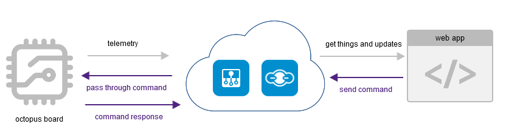

# Bosch IoT Things - Octopus bidirectional use case via Bosch IoT Hub


## Summary

This example shows how to use Bosch IoT Things and Bosch IoT Hub to connect your device with our cloud services and a frontend solution. It shows how to subscribe to our Bosch IoT Suite for Asset Communication service, how to use its HTTP endpoints, and how to send data within these services.</br>
Furthermore, the example provides a prototype of a real world device - based on the Octopus board (ESP8266) - and a web application to manage your things.

The **device** will be able to connect automatically to a given wireless internet access, to send telemetry data to the
Things service, and to react to messages which will be sent by the web application.

The **web application** will use our Bosch IoT Things HTTP endpoints to communicate with the "digital twin" of the device and the device itself.

We will use the _telemetry_, _event_ as well as the _command & control_ pattern of the Bosch IoT Hub.



## Setting up Bosch IoT Suite for Asset Communication

All services can be booked online at [Bosch IoT Suite](https://bosch-iot-suite.com/tutorials/howtosubscribe/) portal. For your subscription, you will need a
_Bosch ID_ for authentication. If you don't have a Bosch ID yet, feel free to register a new account. Once you are successfully registered, you will be redirected to the Bosch IoT Suite portal.

You will need to subscribe for **Bosch IoT Suite for Asset Communication** - a ready-to-use integration of Bosch IoT Hub and Bosch IoT Things. Furthermore, you will get a preconfigured connection between both services and a thing-dashboard for your real world octopus-device.

Once you have an own service instance of Bosch IoT Things and Bosch IoT Hub, ....


// TODO - Buchungsprozess (Asset Communication package - MIT oder OHNE Screenshots?)
// TODO - Device Provisioning Call über Swagger durchführen (Für Einträge siehe Screenshot)
// TODO - Settings File vom Arduino anpassen und speichern.
// TODO - ARDUINO konfigurieren und Response verwenden für Credentials
// -------------------------------------Bis hierhin wie telemetry ------------------------------------------------
// TODO - Frontend verwenden und beide Authentifizierungs-Varianten kurz vorstellen.


You will find a link to the Things dashboard under point 'Actions' in your
[service subscriptions](https://accounts.bosch-iot-suite.com/subscriptions/) view.

Select the connection category "Bosch IoT Hub" and the wizard will guide you through the creation process. Find your Hub credentials in your
[service subscriptions](https://accounts.bosch-iot-suite.com/subscriptions/) view.

**Tip:** The connection creation wizard will ask for an authorization context. For this example, please use
`integration:<YOUR-SOLUTION-ID>:octopus`, as the Octopus board will be prepared accordingly.</br>
Find details at [Manage your connections](https://things.eu-1.bosch-iot-suite.com/dokuwiki/doku.php?id=2_getting_started:booking:manage-y-connection).

## Configure the Java program

The next step is to use a little Java program, which will create a thing and a policy with the authorization context `integration:<YOUR-SOLUTION-ID>:octopus`.

Furthermore, the program registers the Octopus device with valid credentials at the Bosch IoT Hub.

Before you can start using this program, you will need to configure the `src/main/resource/application.properties` file. Fill out the empty fields with valid credentials, then start the program with:
`mvn clean compile exec:java` in the root folder of the project.

## Prepare the Octopus device with Arduino

### Requirements

1. An Arduino or another developer board like "Funduino" etc. </br> This example will work with an
   Octopus-board, </br>however, most of the code will work with every other board with an ESP8266 on it.
2. [Arduino IDE](https://www.arduino.cc/en/Main/Software)

### Preparing

1. Add the ESP8266 Platform to the IDE, see [ESP8266 Arduino Platform](https://github.com/esp8266/Arduino).
2. Install the following libraries (Sketch -> Include Library -> Manage Libraries)
   1. [Adafruit Unified Sensor Library](https://github.com/adafruit/Adafruit_Sensor)
   2. [Adafruit BME680 library](https://github.com/adafruit/Adafruit_BME680)
   3. [Adafruit BME280 library](https://github.com/adafruit/Adafruit_BME280)
   4. [Adafruit BNO055 library](https://github.com/adafruit/Adafruit_BNO055)
   5. [Adafruit NeoPixel library](https://github.com/adafruit/Adafruit_NeoPixel)
   6. [PubSubClient library](https://github.com/knolleary/pubsubclient)
   7. [ArduinoJson](https://github.com/bblanchon/ArduinoJson)
   8. [ESP8266Ping](https://github.com/dancol90/ESP8266Ping)
3. _IMPORTANT:_ Edit the file `${ArduinoDirectory}/libraries/pubsubclient/src/PubSubClient.h` and set the
   `MQTT_MAX_PACKET_SIZE` to `2048`.

### Configure with valid credentials

The Arduino Sketch we have prepared publishes the sensor information via the Bosch IoT Hub to Bosch IoT Things.

**Tip**: Find the information model of the Octopus device in the Eclipse Vorto repository.
http://vorto.eclipse.org/#/details/com.bosch.iot.suite:OctopusSuiteEdition:1.0.0

Open `iot-device/octopus-hub/octopus-hub.ino` in your Arduino IDE.

All properties have to be set in `iot-device/octopus-hub/settings.h`.
Just create this file from the following template and replace XXX placeholders with your configuration properties.

```cpp
#ifndef SETTINGS_H
#define SETTINGS_H

// ---- WiFi configuration ----
#define WIFI_SSID "XXX" // The SSID of the WiFi you want your octopus board to connect to
#define WIFI_PASSWORD "XXX" // The password of the WiFi you want your octopus board to connect to

// ---- Things registration properties ----
#define THINGS_NAMESPACE "XXX" // The namespace you created in your solution
#define THING_NAME "octopus" // should not be changed unless you changed code in the java preparation program. This is the thing id without the namespace.

// ---- Hub registration properties ----
#define HUB_TENANT "XXX" // The tenant id of your hub instance
#define HUB_DEVICE_ID "XXX" // The device id that was printed out by the java preparation program
#define HUB_DEVICE_AUTH_ID "XXX" // The auth id that was printed out by the java preparation program
#define HUB_DEVICE_PASSWORD "XXX" // The device password that was printed out by the java preparation program

// ---- Update rate of sensors ----
#define SENSOR_UPDATE_RATE_MS 5000 // Print updated sensor value every 5 seconds
#define LOOP_DELAY 100

// ---- Hub MQTT configuration ----
// Do not change this
#define MQTT_BROKER "mqtt.bosch-iot-hub.com"
#define MQTT_PORT 8883

//#define BME280 // uncomment this line if your board has a BME280 instead of BME680

extern const unsigned char mqtt_server_ca[];
extern const unsigned int mqtt_server_ca_len;

#endif
```

Once you have done that, you can flash the Sketch to your developer board.
The device will connect automatically to Bosch IoT Hub, which forwards the data to Bosch IoT Things.

The prepared Arduino sketch will connect to the Bosch IoT Hub with TLS standard,
send and receive MQTT messages, read sensors data, and depending on incoming messages (from the web application) it will set new values for the LED on the board.

Feel free to play with code.

## Front-end

The example in [iot-frontend](iot-frontend/) uses following frameworks:

- [Vue.js](https://vuejs.org)
- [Bootstrap](http://getbootstrap.com/)
- [axios](https://github.com/axios/axios)
- [Vuex](https://vuex.vuejs.org/)
- [Codemirror](https://codemirror.net/)

### Getting started

All the code can be found under [iot-frontend](iot-frontend/).

**Tip**: Our Demo section provides the [Octopus-bidirectional example](https://demos.s-apps.de1.bosch-iot-cloud.com/octopus-bidirectional/) online.<br/>

You can run the example locally as well - just follow the instructions below.

Installation:

```bash
$ cd iot-frontend

// or install dependencies using npm
$ npm i
// or
$ npm install
```

Running Dev-Server (with hot reloading):

```bash
// serving the ui using yarn
$ npm run serve
```

When everything is set up properly, you have access to the Command & Control Example through
`http://localhost:3000`

## Use the web app to remotely change the LED setting

We assume you work with the version hosted at our demo
[Octopus-bidirectional example](https://demos.s-apps.de1.bosch-iot-cloud.com/octopus-bidirectional/).

Log in with your user credentials. Find details at [Register Evaluation User](https://things.eu-1.bosch-iot-suite.com/dokuwiki/doku.php?id=examples_demo:createuser) and make sure the user is empowered in the [policy of the octopus](https://things.eu-1.bosch-iot-suite.com/dokuwiki/doku.php?id=examples_tutorial:policy_connection:policy_connection#dempower_a_device_to_update_the_hello_world_thing).

After you have added your credentials and pressed _connect_, you should see a list with your things
(at least the octopus).

Just click on the thing you want to observe or send data to.<br/>
Depending on your device, you can now send command messages to it.

This example provides LED control on the Octopus board via messages.

Send following message to the topic `switch_led`.

```json
{
  "r": 0,
  "g": 0,
  "b": 0,
  "w": 0
}
```

This is in fact a POST request at the [Messages API](https://apidocs.bosch-iot-suite.com/?urls.primaryName=Bosch%20IoT%20Things%20-%20API%20v2#/Messages).

The response will be either _success_ or an _error_ message.

In case the request was successful, the LED is switched off. The board will send the respective telemetry data to the Hub, which forwards the data to Bosch IoT Things.

The web application uses SSE ('server sent events') to get live updates from Bosch IoT Things - these updates are directly
reflected in the web application.

From this point on feel free to extend the code and build your own IoT solution.

Happy coding!
