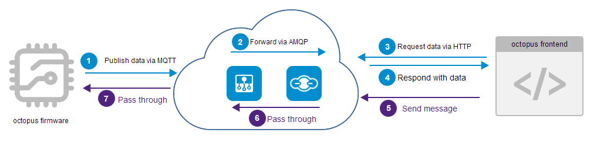
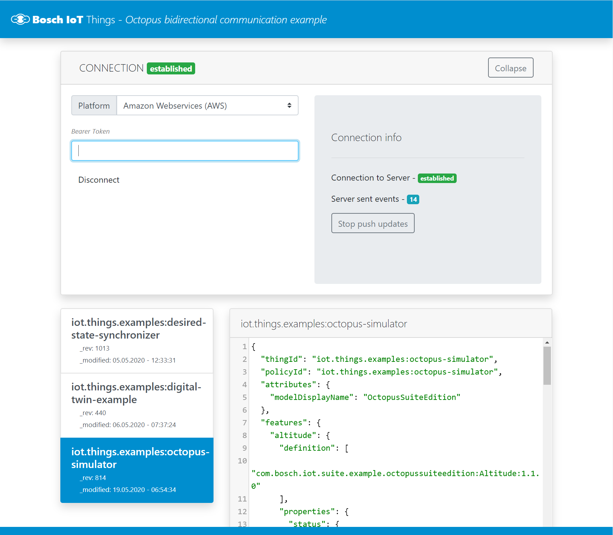

# Octopus frontend

This example provides a web application to manage your things.
It shows how to use the Bosch IoT Things API to communicate with the "digital twin" of the device and the physical device itself.

Further, the example assumes that you have successfully connected a device, and shows how to send command-and-control messages via the HTTP API to the physical device. Once your message reaches the device, and the firmware knows how to react on it, the respective change is reported back to the digital twin and visible on the frontend. 



## Frontend screenshot

The frontend will look like in the following screenshot.



The Bearer Token input field is required for authentication.
In case your went through the _octopus-firmware_ or _octopus-simulator_ example, you might have created already a Suite authorization token.
Otherwise, [Create a Suite Auth Client](https://docs.bosch-iot-suite.com/asset-communication/Create-a-Suite-Auth-client.html) as described in the Asset Communication package documentation.
Upon request, the client will issue a token, which is valid 60 minutes.

### Frontend dependencies

The example uses the following dependencies:

- [Vue.js](https://vuejs.org)
- [Bootstrap](http://getbootstrap.com/)
- [Axios](https://github.com/axios/axios)
- [Vuex](https://vuex.vuejs.org/)
- [Codemirror](https://codemirror.net/)

### Getting started

Installation:

```bash
$ npm install
```

Running Dev-Server (with hot reloading):

```bash
$ npm run serve
```

You can now open your browser and navigate to the app at `http://localhost:3000`

## Use the app to remotely change the LED settings of an Octopus device

### Authenticate with a JWT

Issue a new token at https://accounts.bosch-iot-suite.com/oauth2-clients/.
Copy it to your clipboard and enter it into the Bearer Token field. Then click _connect_ and you should see a list with things, which have been created in this context. At least we assume the Octopus device has been provisioned using the same token, thus, the policy should allow to read it and to send messages.

Click on a thing to see its details (JSON).

Depending on your device, you can now send command messages to it.

This example provides LED control on the Octopus board via messages.

Send following message to the topic `switch_led`.

```json
{
  "r": 0,
  "g": 0,
  "b": 0,
  "w": 0
}
```

This is in fact a POST request at the [Messages API](https://apidocs.bosch-iot-suite.com/?urls.primaryName=Bosch%20IoT%20Things%20-%20API%20v2#/Messages).

The response will be either _success_ or an _error_ message.

In case the request was successful, the LED is switched off. The board will send the respective telemetry data to the Hub, which forwards the data to Bosch IoT Things.

The web application uses SSE ('server sent events') to get live updates from Bosch IoT Things - these updates are directly reflected in the web application.

From this point on, feel free to extend the code and build your own IoT solution.

Happy coding!
