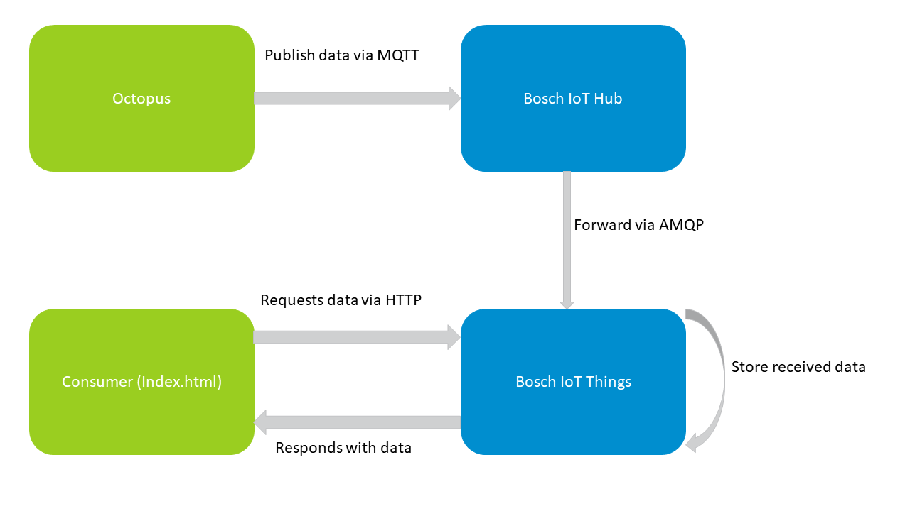
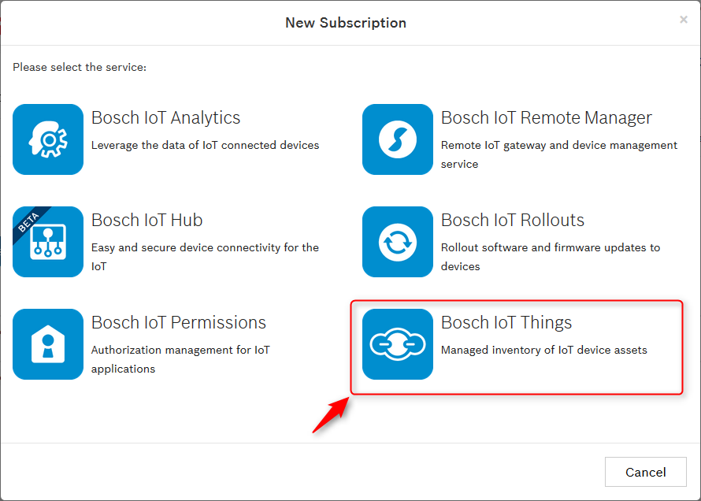
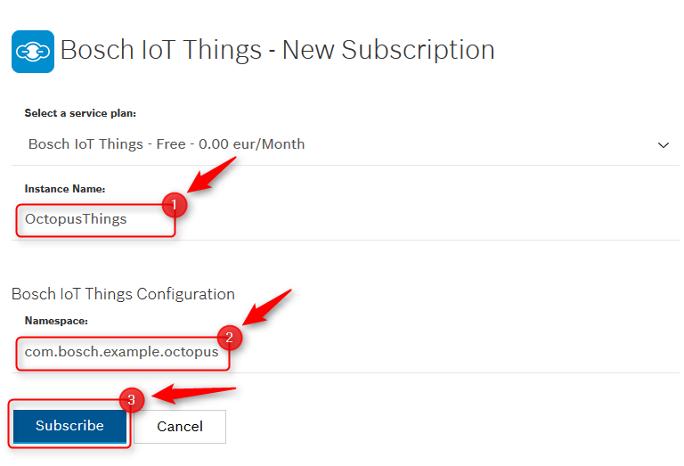
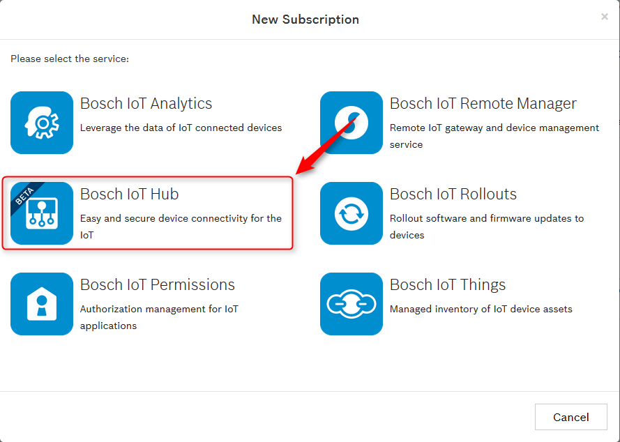

# Using the Octopus board with the Bosch IoT Suite

This example shows how to use the Octopus board (Bosch IoT Suite edition) with the Bosch IoT Suite.
In the image below we illustrated the components of this example and how they will interact with each other.

Before you can start, you have to prepare your setup. This includes the following steps:
1. [Setting up the Arduino IDE](#setup-ide)
2. [Subscribe for the Bosch IoT Suite service instances](#subscribe-for-bosch-iot-suite-service-instances)
5. [Configure the example with your credentials](#configure-the-example)

## Requirements

* JDK 8 or higher
* Maven 3

## About the Octopus board
The Octopus board is created by Guido Burger. Its original purpose was to be used as a teaching tool for Hackathons in
secondary schools in Germany. It features a number of sensors, and the ability to connect sensors, inputs, and 
actuators in a relatively simple way. More information and the source code for the schematics can be found on the 
<a href="http://fab-lab.eu/octopus/">Fab-Lab.eu Octopus page</a>. 
While Guido Burger offers some boards in his Tindie store, overall the Octopus board is a not-for-profit activity.
The Octopus board is a small board based on a ESP8266 Chip that can be programmed e.g. using the Arduino IDE.
The special thing about this board is, that it already contains components that makes it a ready-to-run starter-kit 
to experiment with the Internet of Things.
Here you can see a detailed description of the official Octopus Board used for the "Nationaler IT Gipfel".

Source: [Tindimedia](https://cdn.tindiemedia.com/images/resize/tPhVtjN_DuxDKaRkY0-bOKacDbU=/p/74x59:1024x692/full-fit-in/2400x1600/i/52962/products/2016-12-08T20%3A25%3A54.337Z-octo_pinout_final_top.jpg)

For example, the Bosch IoT Suite edition board contains the following sensors:
* [Bosch Sensortec BNO055](https://www.bosch-sensortec.com/bst/products/all_products/bno055) 
9-axis absolute orientation sensor – provides acceleration, gyroscope, spatial positioning, magnetic field etc.
* [Bosch Sensortec BME680](https://www.bosch-sensortec.com/bst/products/all_products/bme680)
environmental sensor – provides temperature, humidity, air pressure, altitude, air quality

In this example we use both of these sensors as well as the WiFi component and the two LEDs.
## Programming your board
To program your board you can use the [Arduino IDE](https://www.arduino.cc/en/Main/Software).
There you can write the code that should be executed on your board and upload it to your board.

### Setup IDE
1. Download [Arduino IDE](https://www.arduino.cc/en/Main/Software)
2. Configure [ESP8266 board support](https://learn.adafruit.com/adafruit-feather-huzzah-esp8266/using-arduino-ide#install-the-esp8266-board-package)
3. Install the following libraries (Sketch > Include Library > Manage Libraries)
    * [Adafruit Unified Sensor library](https://github.com/adafruit/Adafruit_Sensor)
    * [Adafruit BME680 library](https://github.com/adafruit/Adafruit_BME680)
    * [Adafruit BNO055 library](https://github.com/adafruit/Adafruit_BNO055)
    * [Adafruit NeoPixel library](https://github.com/adafruit/Adafruit_NeoPixel)
    * [PubSubClient library](https://github.com/knolleary/pubsubclient)
    * [ArduinoJson library](https://github.com/bblanchon/ArduinoJson)
4. Edit the file `${ArduinoDirectory}/libraries/pubsubclient/src/PubSubClient.h` and set the MQTT_MAX_PACKET_SIZE
to 2048. This is required because the size of our MQTT messages sent using the PubSubClient library have to fit into
an array of this size.

With this setup, you can run our example that demonstrates how to retrieve the sensor values of your
board. Open `src/main/octopus/octopus-sensor-only/octopus-sensor-only.ino` in Arduino IDE and upload it to your
board.
Next, open Tools>Serial Monitor, specify 115200 baud and you will see the values reported by the sensors printed out.

## Subscribe for Bosch IoT Suite service instances
All cloud services of the Bosch IoT Suite can be booked online at the [Bosch IoT Suite portal](https://accounts.bosch-iot-suite.com/subscriptions).
For all subscriptions, you will need to authenticate with a Bosch ID. In case you have no Bosch ID yet, feel free to register a new user account.
Once the authentication is successful, you will be re-directed to the Bosch IoT Suite portal.

### Bosch IoT Things
Bosch IoT Things is a service that allows you to create a digital twin of a thing, in our example the Octopus board.
This means Bosch IoT Things will mirror your device and will make for example the values of the sensors of your board
available to any interested party you allow to access the information.
The cool thing hereby is that it doesn't matter if your device is available at the time the other party asks for 
sensor values.
Bosch IoT Things will deliver the last known state of your device.

For this example you need a Bosch IoT Things service plan. A free plan can be booked at the
[Bosch IoT Suite portal](https://accounts.bosch-iot-suite.com/subscriptions).

* Click "New Subscription".

* Select "Bosch IoT Things"

* Define a name for your new solution(1) 
* Define a default namespace for your service instance(2) 
* Submit the form by clicking on "Subscribe"(3)

Well done! You have a free Bosch IoT Things service instance.

### Bosch IoT Hub
Bosch IoT Hub is a service that allows to connect devices through various protocols to applications of the Bosch
IoT Suite. For our example your Octopus will communicate via MQTT to the Bosch IoT Suite services.

For this example you need a Bosch IoT Hub service plan . A free plan can be booked at the
[Bosch IoT Suite portal](https://accounts.bosch-iot-suite.com/subscriptions).
  
* Click "New Subscription".

* Select "Bosch IoT Hub"

* Define a name for your new Hub instance(1) 
* Submit the form by clicking "Subscribe"(2)

Well done! You have a free Bosch IoT Hub service instance.

### Bosch IoT Permissions

Bosch IoT Permissions is a service that allows you to create and manage users inside the Bosch IoT Suite.
To make it easier for you to start with the Bosch IoT Suite we provide an instance of Bosch IoT Permissions.
Follow [this description](https://things.s-apps.de1.bosch-iot-cloud.com/dokuwiki/doku.php?id=006_demo:01_createuser)
if you don't have an instance of Bosch IoT Permissions, yet.
If you're already familiar with Bosch IoT Permissions you can use your own instance and create the user at your own
instance.
This user will be used as technical user to access the API of your Bosch IoT Suite service instances during this
example.

## Activate protocol binding
 > Coming soon: UI to establish connection between Bosch IoT Things and Bosch IoT Hub.

Have a look at
[our documentation](https://things.s-apps.de1.bosch-iot-cloud.com/dokuwiki/doku.php?id=005_dev_guide:006_message:007_protocol_bindings:amqp10_binding)
to find out how to activate protocol binding.

## Configure the example

Now that you have plans of all Bosch IoT Suite services required to run this example, continue to configure the example.

There are two parts that need to be configured:
1. A Java program
2. The Arduino Sketch

### Configure the Java Program

We provided a small Java program that will do the following four steps for you:

* Register a representation of your Octopus board as a thing at Bosch IoT Things
* Create a policy in Bosch IoT Things that will define the access policy to the created thing.
  This policy defines that the owner (your permissions user) has full access to the Octopus twin and that messages from
  hub are allowed to write to the features of your Octopus twin.
* Register the device at Bosch IoT Hub
* Create credentials for the registered device so you can access it.

To make this work, the program needs a few configuration properties that you can define at 
`src/main/resource/application.properties`.

Then, you can start the program with the following command in a terminal inside the example directory:
 
 `mvn clean compile exec:java`
 
 All information about credentials and IDs will be printed out to the terminal.

### Configure the Arduino Sketch
The Arduino Sketch, we have prepared, publishes the sensor information via the Bosch IoT Hub to Bosch IoT Things.

Open `src/main/octopus/octopus-mqtt/octopus-mqtt.ino` in your Arduino IDE.

All properties have to be set in `src/main/octopus/octopus-mqtt/settings.h`

### Retrieve stored sensor data from Bosch IoT Things

The data of the registered thing can be retrieved via the 
[HTTP API of Bosch IoT Things](https://things.s-apps.de1.bosch-iot-cloud.com/documentation/rest/#!/Things/get_things_thingId).

For the ease of this example we provide a view of the data at
`src/main/html/index.html`. The page refreshes every few seconds and displays the data retrieved from Bosch IoT Things.
Because of the 'same-origin-policy' you need to provide this html via a webserver.
For example IntelliJ supports this by right click on the index.html inside intelliJ and select 'Open in Browser'.
We tested it in Firefox.

## Make it run!

You're now fully prepared to let your Octopus board publish its sensor information to Bosch IoT Things.

Just press "Upload" inside the Arduino IDE and wait until it's uploaded.
For troubleshooting, feel free to use the "Serial Monitor" of the Arduino IDE, where you can find the latest log
messages.