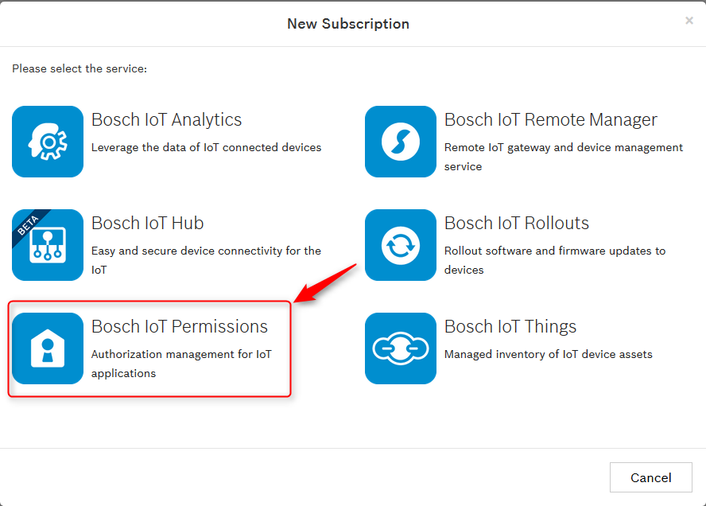
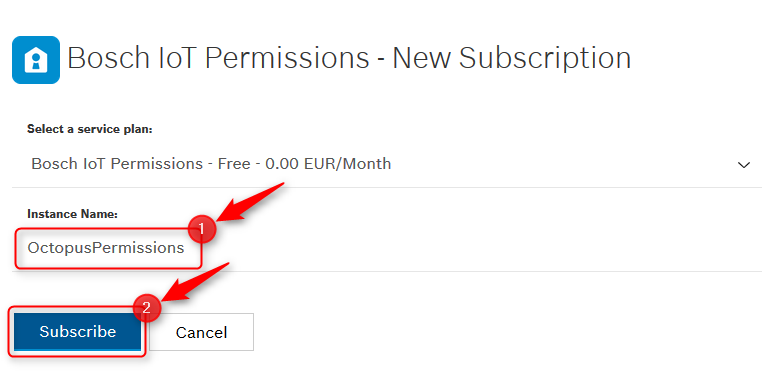
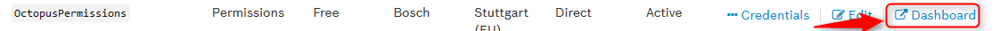
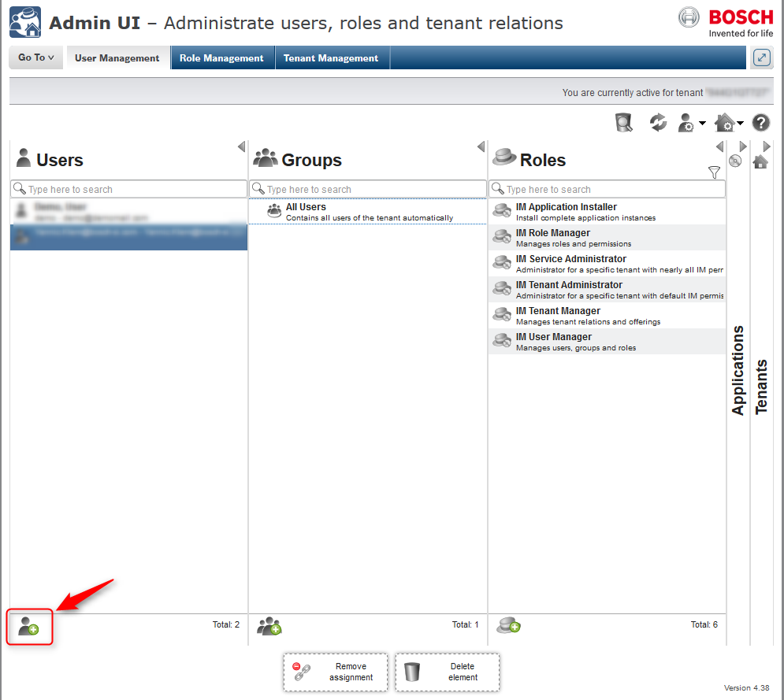
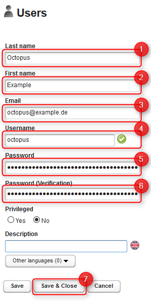
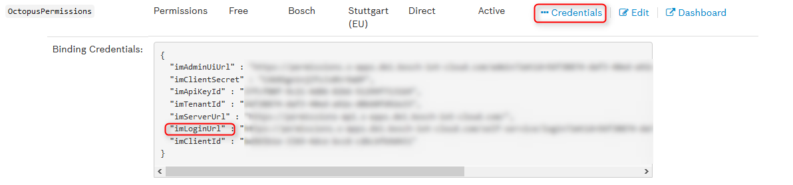

# Using the Bosch IoT Suite edition Octopus-Board with the Bosch IoT Suite

This example shows how to use the Bosch IoT Suite edition Octopus board with the Bosch IoT Suite.

## Preparation
Before you can start you have to prepare your Setup. This includes the following steps:
1. [Setting up the Arduino IDE](#setup-ide)
2. [Create a Bosch IoT Things solution](#create-a-solution)
3. [Create a Bosch IoT Hub instance](#create-an-instance-of-bosch-iot-hub)
3. [Create a Bosch IoT Permissions instance](#create-an-instance-of-bosch-iot-permissions)
4. [Configure the example with your credentials](#configure-the-example) 
### Octopus-Board
The octopus board was created by Guido Burger. Its original purpose was as a teaching tool for Hackathons in 
secondary schools in Germany. It features a number of sensors, and the ability to connect sensors, inputs, and 
actuators in a relatively simple way. More information and the source code for the schematics can be found on the 
<a href="http://fab-lab.eu/octopus/">Fab-Lab.eu Octopus page</a>. 
While Guido Burger offers some boards in his Tindie store, overall the Octopus board is a not-for-profit activity.
The Octopus-Board is a small board based on a ESP8266 Chip that can be programmed e.g. using the Arduino IDE.
The special thing about this board is, that it already contains components that makes it a ready-to-run starter-kit 
to experiment with the Internet of Things.
Here you can see a detailed description of the official Octopus Board used for the "Nationaler IT Gipfel".

For example the board we have contains the following Sensors:
* [Bosch Sensortec BNO055](https://www.bosch-sensortec.com/bst/products/all_products/bno055) 
9-axis absolute orientation sensor – provides acceleration, gyroscope, spatial positioning, magnetic field etc.
* [Bosch Sensortec BME680](https://www.bosch-sensortec.com/bst/products/all_products/bme680)
environmental sensor – provides temperature, humidity, air pressure, altitude, air quality

In this example we use both of these sensors as well as the WiFi component and the two LEDs.
#### Programming your board
To program your board you can use the [Arduino IDE](https://www.arduino.cc/en/Main/Software).
There you can write the code that should be executed on your board and upload it to your board.

##### Setup IDE
1. Download [Arduino IDE](https://www.arduino.cc/en/Main/Software)
2. Configure [ESP8266 board support](https://learn.adafruit.com/adafruit-feather-huzzah-esp8266/using-arduino-ide#install-the-esp8266-board-package)
3. Install the following libraries (Sketch > Include Library > Manage Libraries)
    * [Adafruit Unified Sensor library](https://github.com/adafruit/Adafruit_Sensor)
    * [Adafruit BME680 library](https://github.com/adafruit/Adafruit_BME680)
    * [Adafruit BNO055 library](https://github.com/adafruit/Adafruit_BNO055)
    * [Adafruit NeoPixel library](https://github.com/adafruit/Adafruit_NeoPixel)
    * [PubSubClient library](https://github.com/knolleary/pubsubclient)
    * [ArduinoJson library](https://github.com/bblanchon/ArduinoJson)
   
With this setup you are able to execute our example that demonstrates how to retrieve the sensor values of your 
board. Just open `src/main/octopus/octopus-sensor-only/octopus-sensor-only.ino` in Arduino IDE and upload it to your 
board.
After opening Tools>Serial Monitor specify 115200 baud and you will see the values reported by the sensors printed out.

### Bosch IoT Things
Bosch IoT Things is a service that allows you to register your "thing" and create a digital twin.
This means Bosch IoT Things will mirror your device and will make for example the values of the sensors of your board
available to any interested party you allow to access the information.
The cool thing hereby is that it doesn't matter if your device is available at the time the other party asks for 
sensor values.
Bosch IoT Things will deliver the last known state of your device.

####Create a solution
For this example you need a free Bosch IoT Things service plan that you can get at the 
[Bosch IoT Suite Portal](https://accounts.bosch-iot-suite.com/subscriptions).

Just click on "New Subscription".

Select "Bosch IoT Things"

Define a name for your new solution(1) 
Define a default namespace for your new solution(2) 
Submit the form by clicking on "Subscribe"(3)

Well done! You just created your first solution in Bosch IoT Things.

### Bosch IoT Hub
Bosch IoT Hub is a service that for example allows your device to speak via MQTT to the Bosch IoT Suit services.

#### Create an instance of Bosch IoT Hub
For this example you need a free Bosch IoT Hub service plan that you can get at the
[Bosch IoT Suite Portal](https://accounts.bosch-iot-suite.com/subscriptions).
  
Just click on "New Subscription".

Select "Bosch IoT Hub"

Define a name for your new hub instance(1) 
Submit the form by clicking on "Subscribe"(2)

Well done! You just created your first instance of Bosch IoT Hub.

### Bosch IoT Permissions

Bosch IoT Permissions is a service that allows you to create and manage users inside the Bosch IoT Suite.

#### Create an instance of Bosch IoT Permissions
For this example you need a free Bosch IoT Permissions service plan that you can get at the
[Bosch IoT Suite Portal](https://accounts.bosch-iot-suite.com/subscriptions).

Just click on "New Subscription".

Select "Bosch IoT Permissions"

Define a name for your new permissions instance(1) 
Submit the form by clicking on "Subscribe"(2)

Well done! You just created your first instance of Bosch IoT Permissions.

#### Create a user for this example

Now you can create a user that will be used as technical user for API calls in this example.

Just click on the "Dashboard" link of your Bosch IoT Permissions instance.

Then click on the Add User Button.

Now fill in the form to create a new user and submit with "Save & Close".

You need to login once to change your password. Otherwise this account will be locked and can't be used for 
authentication.

To login visit the login url that you can find in the credentials of your Bosch IoT Permissions instance.

Just log in with the credentials you just defined and provide a new password.

### Configure the example

Now that you have a free plan of all required Bosch IoT Suite Services for this example, you can continue to 
configure the example.

#### Configure the Preparation

We provided a small java program that will do the following four things for you:

* Registers a representation of your octopus board as a thing at Bosch IoT Things
* Creates a policy in Bosch IoT Things that will define the access policy to the created thing
* Registers the device at Bosch IoT Hub
* Creates credentials for the registered device so you're able to access it.

To make this work, the program needs a few configuration properties that you can define at 
`src/main/resource/application.properties`.

Then you can start the preparation with the following command:
 
 `mvn clean compile exec:java`
 
 All information about credentials and IDs will be printed out. 
 
#### Activate protocol binding
 > Coming soon: Establish connection between Bosch IoT Things and Bosch IoT Hub. 
 
 See 
 [here](https://things.s-apps.de1.bosch-iot-cloud.com/dokuwiki/doku.php?id=005_dev_guide:006_message:007_protocol_bindings:amqp10_binding)
 how to activate protocol binding.
 
#### Configure the Arduino Sketch

The Arduino Sketch, we have prepared, publishes the sensor information via the Bosch IoT Hub to Bosch IoT Things.

Open `src/main/octopus/octopus-mqtt/octopus-mqtt.ino` in your Arduino IDE.

All properties has to be set in `src/main/octopus/octopus-mqtt/settings.h`

### Retrieve stored sensor data from Bosch IoT Things

The data of the registered thing can be retrieved via the 
[HTTP Api of Bosch IoT Things](https://things.s-apps.de1.bosch-iot-cloud.com/documentation/rest/#!/Things/get_things_thingId).

For the ease of this example we provided a view of the data at 
`src/main/html/index.html` that refreshes every few seconds and displays the data retrieved from Bosch IoT Things.
Because of the 'same-origin-policy' you need to provide this html via a webserver.
For example IntelliJ supports this by right click on the index.html inside intellij and select 'Open in Browser'.
We tested it in FireFox so this should work. 
## Make it run!

You're now fully prepared to let your octopus board publish its sensor information to Bosch IoT Things.

Just press "Upload" inside the Arduino IDE and wait until its uploaded.
You can open the Serial Monitor to have a look at log-messages for troubleshooting.