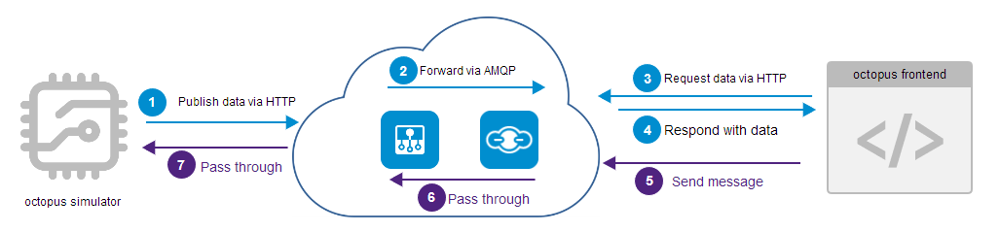

# Octopus device simulator

[](https://github.com/standard/semistandard)

This example provides a Node.js simulator for the Octopus board (ESP8266) described 
at [octopus-firmware](../octopus-firmware).
It shows how to subscribe to Bosch IoT Suite for Asset Communication package and how to use its API to 
provision a device. You can use it if you don't have access to an Octopus device.

Because company proxies will often block MQTT connections from a company device, this simulator will use the **HTTP**
API of Bosch IoT Hub, instead of using the MQTT API like the octopus-firmware. Proxy configuration
will be read automatically from the `https_proxy` environment variable.



The simulator will send telemetry data to the
Things service, and will react to messages which can be sent by a web application, e.g. [octopus-frontend](../octopus-frontend).

The example is structured in following steps:

1. [Subscribe to the Bosch IoT Suite for Asset Communication](#subscribe-to-the-bosch-iot-suite-for-asset-communication)
2. [Register the device via Device Provisioning API](#register-the-device-via-device-provisioning-api)
3. [Prepare the Octopus device simulator](#prepare-the-octopus-device-simulator)

## Subscribe to the Bosch IoT Suite for Asset Communication

All services can be booked online at [Bosch IoT Suite](https://bosch-iot-suite.com/tutorials/howtosubscribe/) portal. For your subscription, you will need a
_Bosch ID_ for authentication. If you don't have a Bosch ID yet, feel free to register a new account. Once you are successfully registered, you will be redirected to the Bosch IoT Suite portal.

You will need to subscribe to the **Bosch IoT Suite for Asset Communication** package - a ready-to-use integration of Bosch IoT Hub and Bosch IoT Things. In order to book your **Bosch IoT Suite for Asset Communication**, please stick to our [Getting Started](https://www.bosch-iot-suite.com/getting-started-bosch-iot-suite-asset-communication/).

### Namespace

Once you have an own service instance of the package, you can define a **namespace** for your solution. All things and policies are required to be created with a namespace. In order to set a namespace, go to your _Service Subscription page_ of the Bosch IoT Suite. Click **Go to Things Dashboard** and navigate to the **Namespace** tab. There, you can type in your namespace in the dedicated input field.

The `namespace` must conform to the reserve domain name notation:
* _must_ start with a lower- or uppercase character from a-z
* _can_ use dots `(.)` to separate characters
* a dot `(.)` must be followed by a lower- or uppercase character from a-z
* numbers _can_ be used
* underscore _can_ be used

### Connection

Furthermore, you will get a pre-configured connection between Hub and Things.
You can see it at the Things dashboard, on tab [Connections/Integrations](https://docs.bosch-iot-suite.com/asset-communication/First-configuration-steps.html#src-894245029_Firstconfigurationsteps-Checkyourconnection).

We will use the _telemetry_, _event_ as well as the _command & control_ pattern of the Bosch IoT Hub.

## Register the device via Device Provisioning API

With just one request at our API, you will be able to register a _device_ (in the context of the Bosch IoT Hub service) and create a digital twin representation of this device (in the context of the Bosch IoT Things service) in _thing_ notation.

In order to do so, you will need a Suite authorization token and a valid request body for your device registration.

### Suite authorization token
Get a new Suite auth token by following the steps of the [Create a Suite Auth Client](https://docs.bosch-iot-suite.com/asset-communication/Create-a-Suite-Auth-client.html) section of the package documentation.
Upon request the client will issue a token, which is valid 60 minutes.

Copy the token to your clipboard. 

### Device Provisioning API docs

Subsequently, open the [Bosch IoT Suite - Device Provisioning API](https://apidocs.bosch-iot-suite.com/index.html?urls.primaryName=Bosch%20IoT%20Suite%20-%20Device%20Provisioning#/provisioning/post__service_instance_id__devices), where you can execute your device registration.

You will need to do the following steps:
1. Authorize your API request via Suite authorization token, by clicking on the **Authorize** button on the upper right corner and paste the token into the dedicated input field.
2. Provide your _service-instance-id_ on the required input-field. You can find your _service-instance-id_ under the **Show Credentials** button of your _Service Subscription page_ in the Bosch IoT Suite.
3. Edit the request body to send a valid message to the server.

Your request body should contain the following information:

```json
{
  "id": "<your-namespace>:<your-device-id>",
  "hub": {
    "device": {
      "enabled": true
    },
    "credentials": {
      "type": "hashed-password",
      "secrets": [
        {
          "password": "<any-password>"
        }
      ]
    }
  },
  "things": {
    "thing": {
      "definition": "com.bosch.iot.suite.example.octopussuiteedition:OctopusSuiteEdition:1.1.0",
      "attributes": {
        "manufacturer": "<my-awesome-company>"
      },
      "features": {
        "acceleration": {
          "definition": [
            "com.bosch.iot.suite.example.octopussuiteedition:Accelerometer:1.1.0"
          ]
        },
        "ambient_temperature": {
          "definition": [
            "com.bosch.iot.suite.example.octopussuiteedition:Temperature:1.1.0"
          ]
        },
        "orientation": {
          "definition": [
            "com.bosch.iot.suite.example.octopussuiteedition:MultipleAxisJoystick:1.1.0"
          ]
        },
        "linear_acceleration": {
          "definition": [
            "com.bosch.iot.suite.example.octopussuiteedition:Accelerometer:1.1.0"
          ]
        },
        "magnetometer": {
          "definition": [
            "com.bosch.iot.suite.example.octopussuiteedition:Magnetometer:1.1.0"
          ]
        },
        "gravity": {
          "definition": [
            "com.bosch.iot.suite.example.octopussuiteedition:Accelerometer:1.1.0"
          ]
        },
        "temperature": {
          "definition": [
            "com.bosch.iot.suite.example.octopussuiteedition:Temperature:1.1.0"
          ]
        },
        "humidity": {
          "definition": [
            "com.bosch.iot.suite.example.octopussuiteedition:Humidity:1.1.0"
          ]
        },
        "pressure": {
          "definition": [
            "com.bosch.iot.suite.example.octopussuiteedition:Barometer:1.1.0"
          ]
        },
        "angular_velocity": {
          "definition": [
            "com.bosch.iot.suite.example.octopussuiteedition:Gyrometer:1.1.0"
          ]
        },
        "voltage": {
          "definition": [
            "com.bosch.iot.suite.example.octopussuiteedition:Voltage:1.1.0"
          ]
        }
      }
    }
  }
}
```

You will need to edit the following placeholders:

* "id": "`<your-namespace>:<your-device-id>`" - Use your created namespace followed by `:` and your specific thing name.
* "password": "`any-password`" - Type in a secure password in plain text. It will be hashed on our server.
* "manufacturer": "`<my-awesome-company>`" - Type in your company Name.

Click _Execute_ to submit the request.

Upon success, you have created a _device_ in the context of Bosch IoT Hub associated with credentials, and an empty digital twin in _thing_ notation associated with a default _policy_.

## Prepare the Octopus device simulator

### Requirements

1. `Node.js >= 10` and `npm >= 6`

### Install all required dependencies

1. Run `npm install` to install all required dependencies.
2. If you are behind a proxy, please set the `https_proxy` environment variable accordingly.

### Configure with valid credentials

The simulator, just like the Octopus device, publishes the sensor information via the Bosch IoT Hub to Bosch IoT Things.

**Tip**: Find the information model of the Octopus device in the Eclipse Vorto repository.
https://vorto.eclipse.org/#/details/com.bosch.iot.suite.example.octopussuiteedition:OctopusSuiteEdition:1.1.0

Set all properties relevant for the connection to our cloud services in a new file named `config.js`.
You can use `config.js.template` as a template. Replace all `XXX` placeholders with your configuration properties 
and write your credentials within the `" "` quotation marks.

Hint: If you want to see how the telemetry data would look like with the BME280 instead of the BME680 sensor,
simply set the `BME_280` config value to `true`. (Spoiler alert: They will look the same, except that the BME280 simulation does not provide `gas_resistance`).

### Start the simulator
Once you have stored the file at the expected location, you can run the simulator by using `npm start`. The simulator
will read mock sensor data and send it via Bosch IoT Hub to Bosch IoT Things. 

The simulator can be stopped later with `CTRL + C`.

## Check your work
At the Things dashboard, navigate to the _Things_ tab, there your new digital twin should be visible. 
As long as the simulator sends data, the chart view should show the changes.

The simulator will also open up a receiver which can react on incoming messages (from a web application), 
and set new values for the LED on the simulated board.

You can try it out either at the [Developer Console](https://docs.bosch-iot-suite.com/asset-communication/Step-4---Remote-control-your-Octopus-device.html), or you can try out the example "**octopus-frontend**". 

Feel free to play with the code.
Happy coding!
