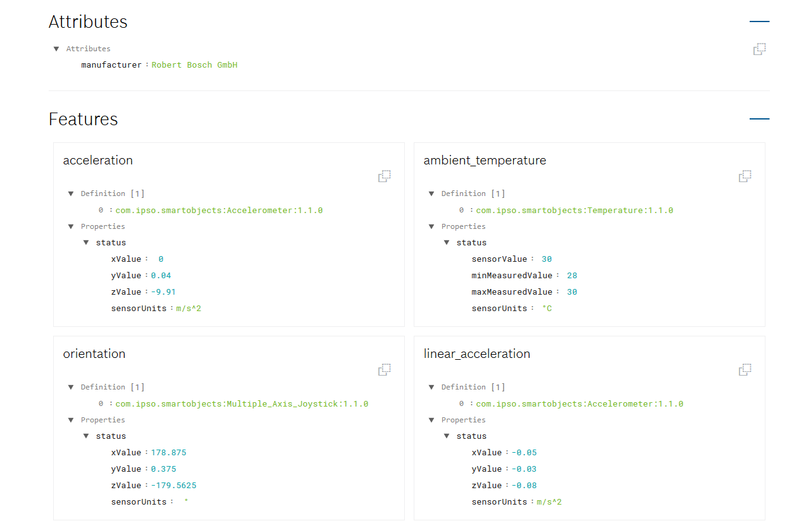
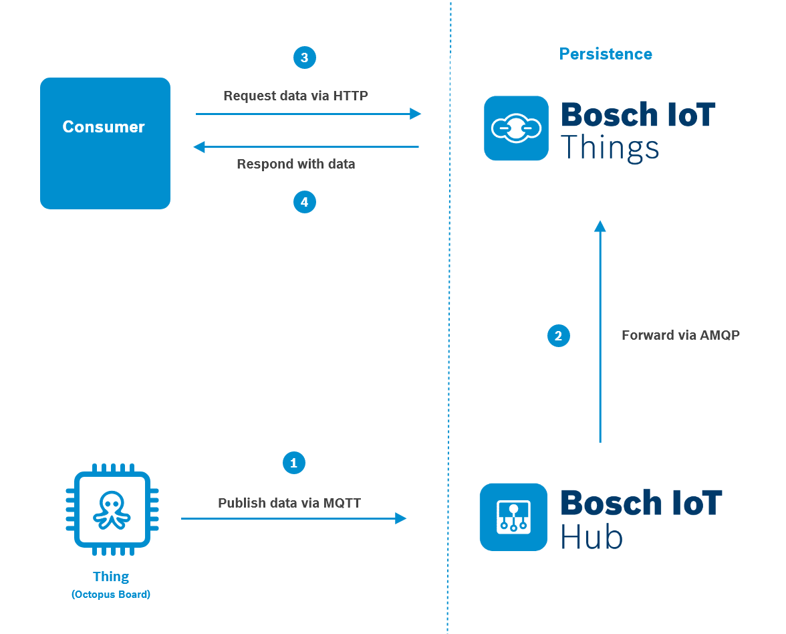

# Bosch IoT Things - Octopus telemetry use case via Bosch IoT Hub



## Summary

This example shows how to use the Octopus board (Bosch IoT Suite edition) with the Bosch IoT Suite.
In the image below, we illustrated the components of this example and how they will interact with each other.



Before you can start, you have to prepare your setup. This includes the following steps:
1. [Subscribe for the Bosch IoT Suite for Asset Communication](#setting-up-bosch-iot-suite-for-asset-communication)
3. [Register the device via the Device Provisioning API](#device-provisioning-api)
4. [Set-up the Arduino IDE](#prepare-the-octopus-device-with-arduino)
5. [Show telemetry data on Things-Dashboard](#show-the-telemetry-data-on-things-dashboard)

We will use the _telemetry event_ pattern of the Bosch IoT Hub.

## About the Octopus board
The Octopus board is created by Guido Burger. Its original purpose was to be used as a teaching tool for hackatons in
secondary schools in Germany. It features a number of sensors, and the ability to connect sensors, inputs, and
actuators in a relatively simple way. More information and the source code for the schematics can be found on the
<a href="https://www.tindie.com/products/FabLab/iot-octopus-badge-for-iot-evaluation/">Fab-Lab.eu Octopus page</a>.
While Guido Burger offers some boards in his Tindie store, overall the Octopus board is a not-for-profit activity.
The Octopus board is a small board based on a ESP8266 chip that can be programmed e.g. using the Arduino IDE.
The special thing about this board is, that it already contains components that makes it a ready-to-run starter-kit
to experiment with the Internet of Things.
Here you can see a detailed description of the official Octopus board used for the "Nationaler IT Gipfel".


Source: [Tindimedia](https://cdn.tindiemedia.com/images/resize/tPhVtjN_DuxDKaRkY0-bOKacDbU=/p/74x59:1024x692/full-fit-in/2400x1600/i/52962/products/2016-12-08T20%3A25%3A54.337Z-octo_pinout_final_top.jpg)

For example, the Bosch IoT Suite edition board contains the following sensors:
* [Bosch Sensortec BNO055](https://www.bosch-sensortec.com/bst/products/all_products/bno055)
9-axis absolute orientation sensor – provides acceleration, gyroscope, spatial positioning, magnetic field etc.
* [Bosch Sensortec BME680](https://www.bosch-sensortec.com/bst/products/all_products/bme680)
environmental sensor – provides temperature, humidity, air pressure, altitude, air quality

## Setting up Bosch IoT Suite for Asset Communication

All services can be booked online at [Bosch IoT Suite](https://bosch-iot-suite.com/tutorials/howtosubscribe/) portal. For your subscription, you will need a
_Bosch ID_ for authentication. If you don't have a Bosch ID yet, feel free to register a new account. Once you are successfully registered, you will be redirected to the Bosch IoT Suite portal.

You will need to subscribe for **Bosch IoT Suite for Asset Communication** - a ready-to-use integration of Bosch IoT Hub and Bosch IoT Things. Furthermore, you will get a pre-configured connection between both services and a thing-dashboard. In order to book your **Bosch IoT Suite for Asset Communication**, please stick to the [Booking a package](https://docs.bosch-iot-suite.com/asset-communication/Subscribe-a-package-instance.html) and [First configuration steps](https://docs.bosch-iot-suite.com/asset-communication/First-configuration-steps.html) sections of our [Getting Started](https://www.bosch-iot-suite.com/getting-started-bosch-iot-suite-asset-communication/).

### Namespace

Once you have an own service instance of the package, we can define a **namespace** for your solution. All things and policies are required to be created with a namespace. In order to set a namespace, go to your _Service Subscription page_ of the Bosch IoT Suite. Click **Go to Dashboard** and navigate to the **Namespace** tab. There, you can type in your namespace in the dedicated input field.

The `namespace` must conform to the reserve domain name notation:
* _must_ start with a lower- or uppercase character from a-z
* _can_ use dots `(.)` to separate characters
* a dot `(.)` must be followed by a lower- or uppercase character from a-z
* numbers _can_ be used
* underscore _can_ be used

## Device Provisioning API

With just one request at our API, you will be able to register a device (in the context of the Bosch IoT Hub service) and create a digital twin representation of this device (in the context of the Bosch IoT Things service) in thing notation.

In order to do so, you will need a Suite authorization token and a valid request body for your device registration. Get a new Suite auth token by following the steps of the [Create a Suite Auth Client](https://docs.bosch-iot-suite.com/asset-communication/Device-provisioning.html#src-894245057_Deviceprovisioning-CreateaSuiteAuthclient) section of the Getting Started.

Subsequently, open the [Bosch IoT Suite - Device Provisioning API](https://apidocs.bosch-iot-suite.com/index.html?urls.primaryName=Bosch%20IoT%20Suite%20-%20Device%20Provisioning#/provisioning/post__service_instance_id__devices), where you can execute your device registration.

You will need to do the following steps:
1. Authorize your API request via Suite authorization token, by clicking on the **Authorize** button on the upper right corner and paste the token into the dedicated input field.
2. Provide your _service-instance-id_ on the required input-field. You can find your _service-instance-id_ under the **Show Credentials** button of your  _Service Subscription page_ in the Bosch IoT Suite.
3. Edit the request body to send a valid message to the server.

Your request body should contain the following information:

```json
{
  "id": "<your-namespace>:<your-device-id>",
  "hub": {
    "device": {
      "enabled": true
    },
    "credentials": {
      "type": "hashed-password",
      "secrets": [
        {
          "password": "<any-password>"
        }
      ]
    }
  },
  "things": {
    "thing": {
      "attributes": {
        "manufacturer": "<my-awesome-company>"
      },
      "features": {
        "acceleration": {
          "definition": [
            "com.ipso.smartobjects:Accelerometer:1.1.0"
          ]
        },
        "ambient_temperature": {
          "definition": [
            "com.ipso.smartobjects:Temperature:1.1.0"
          ]
        },
        "orientation": {
          "definition": [
            "com.ipso.smartobjects:Multiple_Axis_Joystick:1.1.0"
          ]
        },
        "linear_acceleration": {
          "definition": [
            "com.ipso.smartobjects:Accelerometer:1.1.0"
          ]
        },
        "magnetometer": {
          "definition": [
            "com.ipso.smartobjects:Magnetometer:1.1.0"
          ]
        },
        "gravity": {
          "definition": [
            "com.ipso.smartobjects:Accelerometer:1.1.0"
          ]
        },
        "temperature": {
          "definition": [
            "com.ipso.smartobjects:Temperature:1.1.0"
          ]
        },
        "humidity": {
          "definition": [
            "com.ipso.smartobjects:Humidity:1.1.0"
          ]
        },
        "pressure": {
          "definition": [
            "com.ipso.smartobjects:Barometer:1.1.0"
          ]
        },
        "angular_velocity": {
          "definition": [
            "com.ipso.smartobjects:Gyrometer:1.1.0"
          ]
        },
        "voltage": {
          "definition": [
            "com.ipso.smartobjects:Voltage:1.1.0"
          ]
        }
      }
    }
  }
}
```

You will need to edit the following <placeholders>:
* "id": "`<your-namespace>:<your-device-id>`" - _Use your created namespace followed by_ `:` _and your specific thing ID. In our use case it should be_ `yourNamespace:octopus`.
* "password": "`any-password`" - _Type in a secure password in plain text. It will be hashed on our server._
* "manufacturer": "`<my-awesome-company>`" - _Type in your company Name._

Click _Execute_ to submit the request.

Upon success, you have created a _device_ in the context of Bosch IoT Hub associated with credentials, and an empty _digital twin_ in _thing_ notation associated with a default policy.

## Prepare the Octopus device with Arduino

### Requirements

1. An Arduino or another developer board like "Funduino" etc. </br> This example will work with an
   Octopus-board, </br>however, most of the code will work with every other board with an ESP8266 on it.
2. Download the [Arduino IDE](https://www.arduino.cc/en/Main/Software)

### Preparing

1. Add the ESP8266 Platform to the IDE, see [ESP8266 Arduino Platform](https://github.com/esp8266/Arduino) (tested with 2.4.1).
2. Install the following libraries (Sketch -> Include Library -> Manage Libraries)
   1. [Adafruit Unified Sensor Library](https://github.com/adafruit/Adafruit_Sensor) (tested with 1.0.2)
   2. [Adafruit BME680 library](https://github.com/adafruit/Adafruit_BME680) (tested with 1.0.7)
   3. [Adafruit BME280 library](https://github.com/adafruit/Adafruit_BME280) (tested with 1.0.7)
   4. [Adafruit BNO055 library](https://github.com/adafruit/Adafruit_BNO055) (tested with 1.1.6)
   5. [Adafruit NeoPixel library](https://github.com/adafruit/Adafruit_NeoPixel) (tested with 1.1.7)
   6. [PubSubClient library](https://github.com/knolleary/pubsubclient) (tested with 2.7.0)
   7. [ArduinoJson](https://github.com/bblanchon/ArduinoJson) (tested with 5.13.4)
   8. [ESP8266Ping](https://github.com/dancol90/ESP8266Ping) (tested with 2.0.1)
3. _IMPORTANT:_ Edit the file `${ArduinoDirectory}/libraries/pubsubclient/src/PubSubClient.h` and set the
   `MQTT_MAX_PACKET_SIZE` to `2048`.

### Configure with valid credentials

The Arduino Sketch we have prepared publishes the sensor information via the Bosch IoT Hub to Bosch IoT Things.

**Tip**: Find the information model of the Octopus device in the Eclipse Vorto repository.
http://vorto.eclipse.org/#/details/com.bosch.iot.suite:OctopusSuiteEdition:1.0.0

Open  src/main/octopus/octopus-mqtt/octopus-mqtt.ino` in your Arduino IDE.

All properties relevant for the connection to our cloud services have to be set in `src/main/octopus/octopus-mqtt/settings.h`. Replace all XXX placeholders with your configuration properties.

```cpp
#ifndef SETTINGS_H
#define SETTINGS_H

// ---- WiFi configuration ----
#define WIFI_SSID "XXX" // The SSID of the WiFi you want your octopus board to connect to.
#define WIFI_PASSWORD "XXX" // The password of the WiFi you want your octopus board to connect to.

// ---- Things registration properties ----
#define THINGS_NAMESPACE "XXX" // The namespace you created in your solution.
#define THING_NAME "octopus" // Should not be changed - This is the thing id without the namespace.

// ---- Hub registration properties ----
#define HUB_TENANT "XXX" // The tenant id of your hub instance, which is provided by the credentials of the Bosch IoT Suite - service subscriptions page.
#define HUB_DEVICE_ID "XXX" // The device id that was included in the response of the device provisioning API request.
#define HUB_DEVICE_AUTH_ID "XXX" // The auth id that was included in the response of the device provisioning API request.
#define HUB_DEVICE_PASSWORD "XXX" // The device password that was used for the device provisioning API request in plain text.

// ---- Update rate of sensors ----
#define SENSOR_UPDATE_RATE_MS 5000 // Print updated sensor value every 5 seconds
#define LOOP_DELAY 100

// ---- Hub MQTT configuration ----
// Do not change this
#define MQTT_BROKER "mqtt.bosch-iot-hub.com"
#define MQTT_PORT 8883

//#define BME280 // uncomment this line if your board has a BME280 instead of BME680

extern const unsigned char mqtt_server_ca[];
extern const unsigned int mqtt_server_ca_len;

#endif
```

Once you have stored the file at the expected location, verify the sketch.

You can flash the Sketch to your Octopus board. The device will connect automatically to Bosch IoT Hub, which forwards the data to Bosch IoT Things.

The prepared Arduino sketch will connect to the Bosch IoT Hub with TLS standard,
send and receive MQTT messages, read sensors data, and depending on incoming messages (from the web application) it will set new values for the LED on the board.


## Show the telemetry data on Things Dashboard

In this stage, you should be able to see the updated values of your octopus board in our Things dashboard. Make sure that your board is online and the green LED is turned on.

On the _Service Subscriptions Page_, click **Go to Dashboard**. The View of the Bosch IoT Things appears. Navigate to the **Things** tab and choose your digital representation of your octopus board. It should be represented by your **namespace** and your **Thing ID**.

The View is grouped by _General_, _Attributes_ and _Features_, where you can find all the updated values of your real world device. You can also show the data in JSON format, by simply clicking on the **Show JSON** button.

Enjoy your new thing in our Bosch IoT Suite and feel free to play with code!
